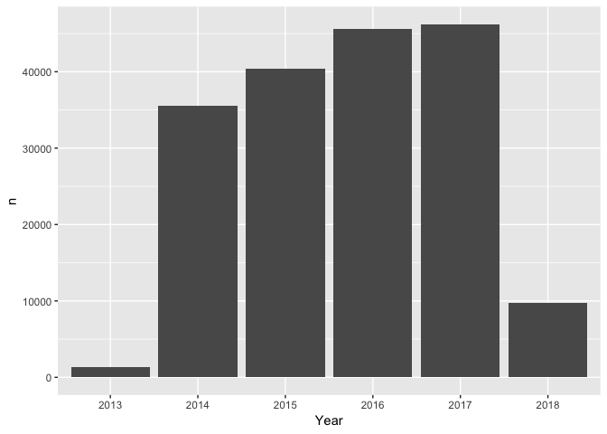
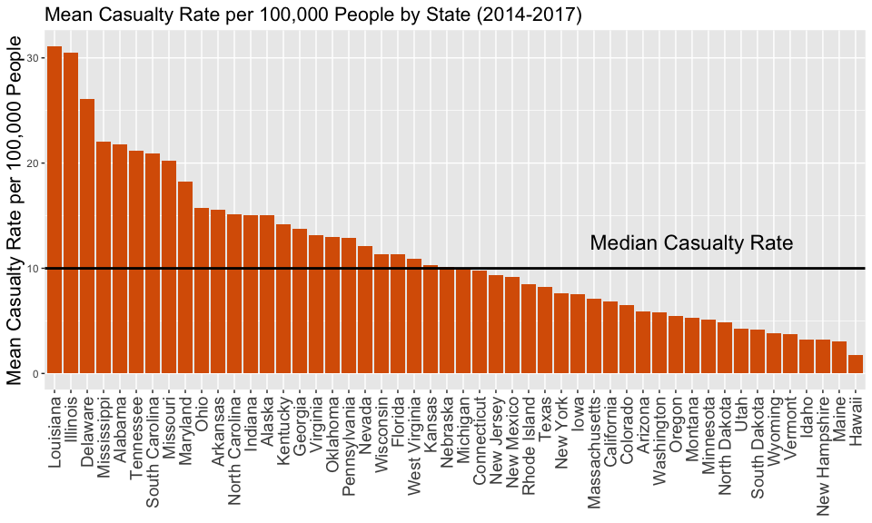
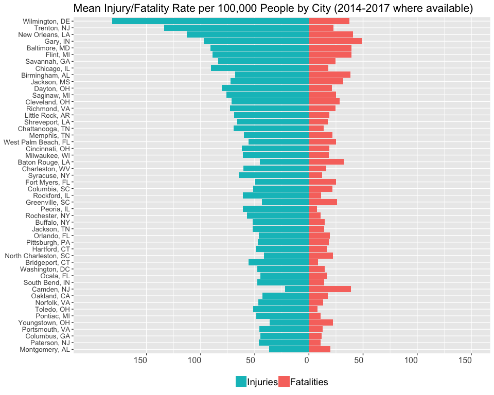
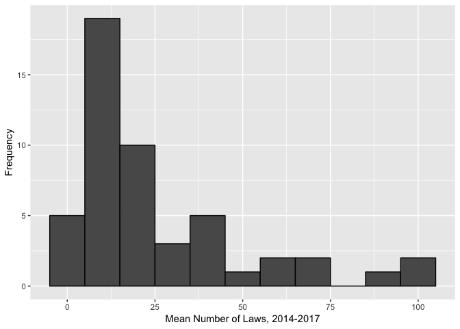
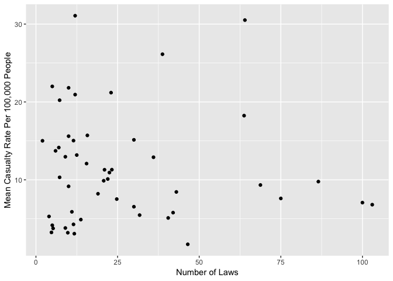
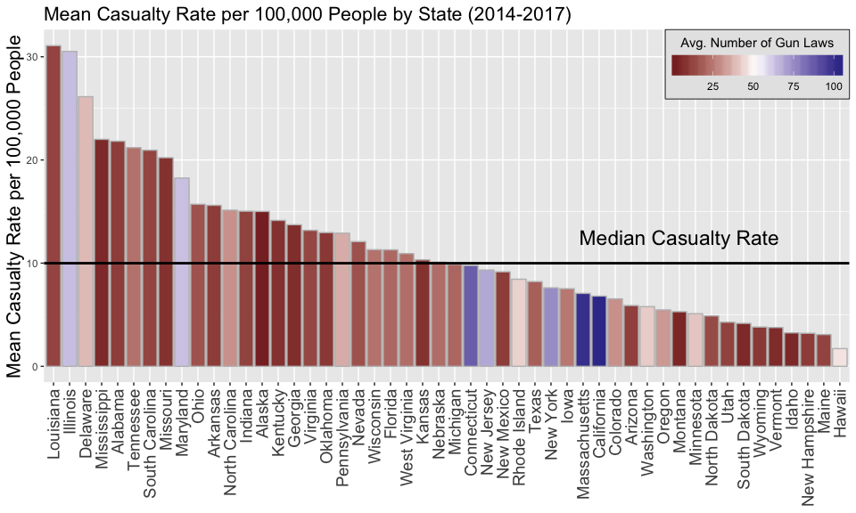
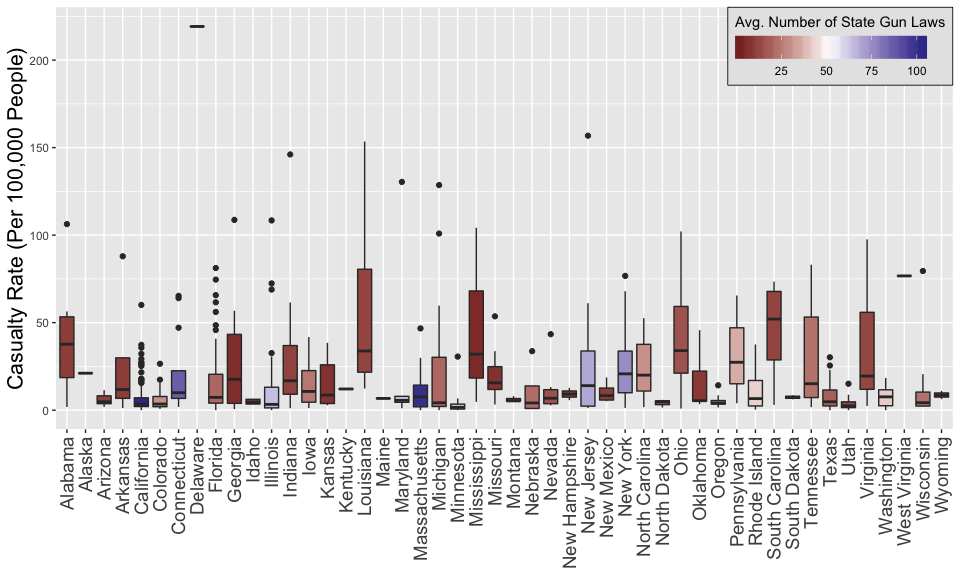
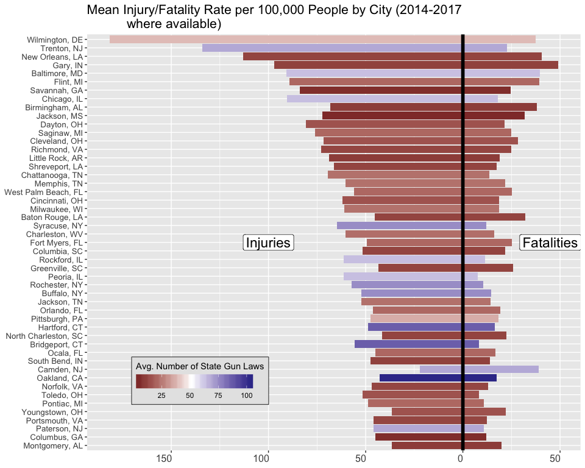

Load libraries:

```r
library(ggplot2)
library(readr)
library(RColorBrewer)
library(reshape2)
library(dplyr)
library(plotly)
library(scales)
```

Read the dataset:

```r
df <- read_csv("data/gun-violence-data_01-2013_03-2018.csv")
```

There are a few columns we don't care about - drop those

```r
gun <- select(df, -c(incident_url, source_url, incident_url_fields_missing, congressional_district, sources, state_house_district, state_senate_district))
```

How many gun casualties (defined as number killed and injured) were there for each year?

```r
gun %>% group_by(Year = format(date, "%Y")) %>% 
      summarize(n = sum(n_injured + n_killed)) %>% 
      ggplot(aes(x = Year, y = n)) + geom_col()
```

<!-- -->

Clearly there are missing data from 2013, and 2018 isn't complete yet. Let's drop these two years. Let's also remove the suicides, incidents involving replica weapons, and officer involved shootings.


```r
gun <- filter(gun, format(date, "%Y") != 2018 & format(date, "%Y") != 2013)

# Remove suicides
gun <- filter(gun, !(grepl("\\|\\|Suicide\\^", incident_characteristics)
                      & n_killed + n_injured < 2))

# Remove shootings involving replica weapons and officer involved shootings
gun <- filter(gun, !grepl("Officer Involved Shooting", incident_characteristics, fixed = TRUE))

gun <- filter(gun, !grepl("Replica", incident_characteristics, fixed = TRUE))
```

How many gun casualties were there on average from 2014-2017?

```r
totalCasualties <- gun %>% 
      group_by(year = format(date, "%Y")) %>% 
      summarize(casualties = sum(n_killed + n_injured), 
                fatalities = sum(n_killed), 
                injuries = sum(n_injured))

colMeans(totalCasualties[,2:4])
```

```
## casualties fatalities   injuries 
##   38528.00   12287.25   26240.75
```

Over 38,000 people per year were either killed (12,000+) or injured (26,000+) by a firearm from 2014-2017. That's a little over 100 people each day, and does not include victims of suicide.

## Most Dangerous States
How many gun casualties were there in each state for 2014-2017?


```r
cols <- brewer.pal(3, "Dark2")
gun %>% group_by(state) %>% 
      summarize(n_casualty = sum(n_killed + n_injured)) %>% 
      ggplot(aes(x = reorder(state, -n_casualty), y = n_casualty)) + 
      geom_col(fill = cols[1]) + 
      theme(axis.text.x = element_text(angle = 90, vjust = 0.5, 
                                       hjust = 1, size = 14)) + 
      theme(axis.title.y = element_text(size = 16)) + 
      theme(plot.title = element_text(size = 16)) + 
      labs(x = NULL, y = "Casualties (Injuries + Fatalities)", 
           title = "Number of Gun Casualties in the US by State for 2014-2017")
```

<!-- -->

The top 5 states with the highest casualty rates are Illinois, California, Texas, Florida, and Ohio. However, these are also highly populated states. What we really want to know is the *per capita* rate, since population is an important factor. I got census data for each state from 2010-2017 from the [U.S. Census Bureau][1], and then calculated the per capita rates (per hundred thousand people) for each year:

[1]:https://factfinder.census.gov/ "U.S. Census Bureau"


```r
# READ IN US POPULATION DATA BY STATE
colNames <- c("id1", "id2", "state", "census2010", "cenbase2010", "2010", "2011", "2012", "2013", "2014", "2015", "2016", "2017")

pop <- read_csv("data/US\ Population\ by\ State/PEP_2017_PEPANNRES_with_ann.csv", skip = 2, col_names = colNames)

# Only keep the columns and rows we want
pop <- select(pop, id1, state, "2014", "2015", "2016", "2017") %>% 
      slice(6:n())

# Casualties by state and year; I removed Washington DC from the state rankings, since it's technically a city, not a state
casByState <- group_by(gun, state, year = format(date, "%Y")) %>% 
      filter(state != "District of Columbia") %>% 
      summarize(n.casualty = sum(n_killed + n_injured), 
                n.injured = sum(n_injured), 
                n.killed = sum(n_killed))

# Add the population and the per capita rate (per 100K people)

# First, generate the population vector:
popList <- numeric()
for (i in 1:nrow(casByState)) {
      popList <- c(popList, as.numeric(pop[pop$state == casByState$state[i], casByState$year[i]]))
}

casByState <- ungroup(casByState) %>% 
      mutate(population = popList, 
             cas.per.capita100K = n.casualty/population*100000,
             k.per.capita100K = n.killed/population*100000, 
             i.per.capita100K = n.injured/population*100000)
```
Now that we have the per-state data for each year, let's take a look at it:

```
## # A tibble: 200 x 9
##    state  year  n.casualty n.injured n.killed population cas.per.capita10…
##    <chr>  <chr>      <int>     <int>    <int>      <dbl>             <dbl>
##  1 Alaba… 2014         857       553      304   4840037.             17.7 
##  2 Alaba… 2015         899       541      358   4850858.             18.5 
##  3 Alaba… 2016        1162       724      438   4860545.             23.9 
##  4 Alaba… 2017        1322       824      498   4874747.             27.1 
##  5 Alaska 2014          62        46       16    736759.              8.42
##  6 Alaska 2015         129        78       51    737979.             17.5 
##  7 Alaska 2016         145        89       56    741522.             19.6 
##  8 Alaska 2017         108        64       44    739795.             14.6 
##  9 Arizo… 2014         355       182      173   6706435.              5.29
## 10 Arizo… 2015         326       162      164   6802262.              4.79
## # ... with 190 more rows, and 2 more variables: k.per.capita100K <dbl>,
## #   i.per.capita100K <dbl>
```

To make plotting a little simpler, let's take the mean of each per capita rate for each state across each year. So, for each state there will be four entries: 2014, 2015, 2016, and 2017.


```r
meanCBS <- group_by(casByState, state) %>% 
      summarize(meanCasRate = mean(cas.per.capita100K), 
                meanKRate = mean(k.per.capita100K), 
                meanIRate = mean(i.per.capita100K))
```

Now let's plot it and see:

```r
ggplot(data = meanCBS, 
      aes(x = reorder(state, -meanCasRate), y = meanCasRate)) + 
      geom_col(fill = cols[2]) + 
      theme(axis.text.x  = element_text(angle = 90, vjust = 0.5, 
                                        hjust = 1, size = 14)) + 
      theme(axis.title.y = element_text(size = 16)) + 
      theme(plot.title = element_text(size = 16)) + 
      labs(x = NULL, y = "Mean Casualty Rate per 100,000 People", 
           title = "Mean Casualty Rate per 100,000 People by State (2014-2017)") +
      geom_hline(yintercept = median(meanCBS$meanCasRate), lwd = 1) +
      annotate("text", label = "Median Casualty Rate", x = 40, y = 12.5, size = 6)
```

<!-- -->

The black line represents the median value for all 50 states. The rankings have changed significantly. The top 5 states with the highest *per capita* casualty rate are Louisiana, Illinois, Delaware, Mississippi, and Alabama. The only state that remained in the top 5 after adjusting for population was Illinois. Clearly, it is critical to consider population when talking about gun violence rates across the country (which does not always happen).

## Most Dangerous Cities
Let's now look at the *cities* with the highest rates of per capita gun violence. I again used data from the [U.S. Census Bureau][1] to find the population of cities in the United States. The dataset I used contained data from 2010-2016 for all cities greater than 50,000 residents. I had to do some manipulation of the city names in order to make them match the cities in the original dataset. Also, since there are no population data for 2017, I just used the population values from 2016 and assumed there wouldn't be any significant changes.


```r
# READ IN US POPULATION DATA BY CITY
colNames <- c("id1", "id2", "country", "tid1", "tid2", "rank", "geography1", "city", "census2010", "cenbase2010", "2010", "2011", "2012", "2013", "2014", "2015", "2016")

citypop <- read_csv("data/US\ Population\ by\ City/PEP_2016_PEPANNRSIP.US12A_with_ann.csv", skip = 2, col_names = colNames)

# Only keep the columns and rows we want (drop all the "government" and "county" entries)
citypop <- select(citypop, tid2, city, "2014", "2015", "2016") %>%
      filter(!grepl("[Cc]ounty|government", city))

# Reformatting city names
cityState <- sub("^(.+) (city( \\(balance\\))?|municipality|village|town), (.+)", "\\1, \\4", citypop$city) %>% 
      strsplit(", ")

# Split up the city column into city and state columns
cityState <- as.data.frame(matrix(unlist(cityState), nrow = length(cityState), 
                                  byrow = TRUE), stringsAsFactors = FALSE)
names(cityState) <- c("city", "state")

# Ventura, CA has a nonstandard entry; fix it
cityState$city[grep("\\(", cityState$city)] <- "Ventura"

# In the original gun violence data, the cities listed for New York are split into the five boroughs. So, for example, Brooklyn and The Bronx are separate entries, when they need to be considered "New York" for our purposes. Let's fix that manually.
ny <- filter(gun, state == "New York")
nycInd <- grep("Manhattan|Queens|Bronx|Staten Island|Brooklyn|New York City", ny$city_or_county)

nyc <- ny[nycInd,] %>% 
      filter(city_or_county != "Queensbury")

# Now go through the gun dataframe and change all relevant city_or_state entries to "New York"
for(i in 1:nrow(nyc)) {
      incident <- nyc$incident_id[i]
      index <- which(gun$incident_id == incident)
      gun[index,"city_or_county"] <- "New York"
}

# Integrate the new columns back to the data frame and rearrange
# Also, since we are missing data for 2017, just reuse the 2016 column
citypop <- mutate(citypop, 
                  city = cityState$city, 
                  state = cityState$state, "2017" = citypop$`2016`) %>% 
      select(tid2, city, state, "2014", "2015", "2016", "2017")
```

Get the data by city for each year. Note: some years will be missing because those cities did not have any reported gun crimes in those years. Although this will affect the mean values for cities without any reported gun crimes in some years, we are only going to look at the top 50 cities. For these cities to be in the top 50, it stands to reason that there will be crimes from all four years.


```r
casByCity <- gun %>% 
      group_by(city_or_county, state, year = format(date, "%Y")) %>%
      summarize(n.casualty = sum(n_killed + n_injured), 
                n.killed = sum(n_killed), 
                n.injured = sum(n_injured))
casByCity
```

```
## # A tibble: 28,663 x 6
## # Groups:   city_or_county, state [?]
##    city_or_county  state          year  n.casualty n.killed n.injured
##    <chr>           <chr>          <chr>      <int>    <int>     <int>
##  1 Abbeville       Louisiana      2014           4        1         3
##  2 Abbeville       Louisiana      2015           5        0         5
##  3 Abbeville       Louisiana      2016           4        1         3
##  4 Abbeville       Louisiana      2017           3        1         2
##  5 Abbeville       South Carolina 2014           1        0         1
##  6 Abbeville       South Carolina 2016           1        0         1
##  7 Abbeville       South Carolina 2017           3        1         2
##  8 Abbotsford      Wisconsin      2015           0        0         0
##  9 Abbott Township Pennsylvania   2014           1        0         1
## 10 Abbottstown     Pennsylvania   2017           0        0         0
## # ... with 28,653 more rows
```

Now, we need a per capita estimate for each city. First we need to generate a vector of populations: figure out if the city in our data frame is actually in the population dataset, and if it is, grab the population for that particular year. Again, the 2017 population values are the same as the 2016 ones.


```r
# Get a per capita (100K) estimate for each city
# First, generate the population vector:
popList <- numeric()
for (i in 1:nrow(casByCity)) {
      theCity <- casByCity$city_or_county[i]
      theState <- casByCity$state[i]
      theYear <- casByCity$year[i]
      ind <- which(citypop$city == theCity & citypop$state == theState)
      
      if (length(ind) > 0 && 
          theCity == citypop$city[ind] && 
          theState == citypop$state[ind]) {
            popList <- c(popList, 
                         as.numeric(citypop[citypop$state == theState & 
                                                  citypop$city == theCity, theYear]))
      } else {
            popList <- c(popList, NA)
      }
}
```

We're also going to need the two letter abbreviations for each state for labels later, so let's grab those and put them in the data frame as well. Don't forget Washington, D.C.!:


```r
# Get the short name for each state and attach it to the tibble
data(state)
abbs <- data.frame("abb" = state.abb, "state" = state.name, 
                   stringsAsFactors = FALSE)
abbs <- rbind(abbs, c("DC", "District of Columbia"), stringsAsFactors = FALSE)
abbList <- unlist(lapply(casByCity$state, 
                         function(x) abbs[which(abbs$state == x),]$abb))
```

Add the population and abbrevation columns, and calculate the mean values for each each state:


```r
meanCBC <- ungroup(casByCity) %>% 
      mutate(abb = abbList, 
             population = popList, 
             cas.per.capita100K = n.casualty/population*100000, 
             k.per.capita100K = n.killed/population*100000, 
             i.per.capita100K = n.injured/population*100000)

# Remove NA values and then compute the mean on the remaining values; sort by mean
meanCBC <- filter(meanCBC, !is.na(population)) %>%
      group_by(city_or_county, state, abb) %>% 
      summarize(meanCasRate = mean(cas.per.capita100K), 
                meanKRate = mean(k.per.capita100K), 
                meanIRate = mean(i.per.capita100K)) %>% 
      arrange(desc(meanCasRate))

meanCBC
```

```
## # A tibble: 736 x 6
## # Groups:   city_or_county, state [736]
##    city_or_county state       abb   meanCasRate meanKRate meanIRate
##    <chr>          <chr>       <chr>       <dbl>     <dbl>     <dbl>
##  1 Wilmington     Delaware    DE           219.      37.4     182. 
##  2 Trenton        New Jersey  NJ           157.      22.8     134. 
##  3 New Orleans    Louisiana   LA           154.      40.6     113. 
##  4 Gary           Indiana     IN           146.      49.0      97.1
##  5 Baltimore      Maryland    MD           130.      39.5      90.9
##  6 Flint          Michigan    MI           129.      39.3      89.2
##  7 Savannah       Georgia     GA           109.      24.6      84.0
##  8 Chicago        Illinois    IL           108.      18.0      90.5
##  9 Birmingham     Alabama     AL           106.      38.2      68.1
## 10 Jackson        Mississippi MS           104.      31.9      72.3
## # ... with 726 more rows
```

Let's plot the top 50:


```r
top50 <- meanCBC[1:50,]

top50 <- arrange(top50, meanCasRate)
top50 <- mutate(top50, meanIRate = -meanIRate, 
                city = paste(city_or_county, sep = ", ", abb))
top50melt2 <- melt(top50[,c("city", "meanKRate", "meanIRate", "meanCasRate")],
                   id.vars = c("city", "meanCasRate"))

ggplot(data = top50melt2) + 
      geom_col(aes(x = reorder(city, meanCasRate), y = value, 
                   fill = variable)) +
      scale_y_continuous(limits = c(-200,150), 
                         breaks = c(200, 150, 100, 50, 0, -50, -100, -150), 
                         labels = c("200", "150", "100", "50", "0", "50", "100", "150")) + 
      theme(axis.text.x = element_text(hjust = .95, size = 12)) + 
      theme(axis.text.y = element_text(vjust = 0.5, size = 10)) +
      theme(axis.title.y = element_text(size = 14)) + 
      theme(plot.title = element_text(size = 16)) + 
      theme(legend.title = element_blank()) + 
      theme(legend.position = "bottom") + 
      theme(legend.text = element_text(size = 14)) + 
      scale_fill_discrete(labels = c("Fatalities", "Injuries"), 
                          guide = guide_legend(reverse = TRUE)) +
      labs(x = NULL, y = NULL) +
      labs(title = "Mean Injury/Fatality Rate per 100,000 People by City (2014-2017 where available)") + 
      coord_flip()
```

<!-- -->

According to the data, the top 5 cities with the most gun violence are:

1. Wilmington, DE
2. Trenton, NJ
3. New Orleans, LA
4. Gary, IN
5. Baltimore, MD

Chicago comes in at 8th, even though Illinois was the second highest per capita state.

### Effect of Gun Legislation on Gun Casualty Rates
One topic that is furiously being debated across the nation is whether or not to pass more/stricter gun laws on top of the ones that already exist. What is the effect of gun laws on casualty rate? Let's analyze this both at the state level and city level.

#### By State
The data about state laws were downloaded from the [State Firearm Law Database][2]. I had to reformat the files by re-saving into Excel because they weren't actually saved as a CSV, so it wouldn't have been easy to read it into R. You can download the reformatted CSV files from [Github][3].

[2]: http://www.statefirearmlaws.org/ "State Firearm Law Database"
[3]: http://github.com/arnagaraja/Gun-Violence "Github"


```r
lawsdf <- read_csv("data/Laws/48_states_1991_data.csv")
lawsdf <- rbind(lawsdf, read_csv("data/Laws/Hawaii_1991_data.csv"))
lawsdf <- rbind(lawsdf, read_csv("data/Laws/Alaska_1991_data.csv"))

# Rename one of the columns to something easy to reference
lawsdf <- rename(lawsdf, law = `Law? 0/1`)
laws.by.year <- group_by(lawsdf, State, Year) %>% summarize(laws = sum(law))

# Grab the years we are interested in, 2014-2017, and take the average number of laws for the period
mean.laws.by.year <- filter(laws.by.year, Year >= 2014) %>% summarize(meanlaw = mean(laws))
```

For a first pass, all we are looking at is the absolute number of laws on the books in each state. For simplicity, we assume that each law is as effective as the next (although that is probably not completely true, and each law's effectiveness most likely varies across each state/municipality and has a number of confounding variables). Let's look at the distribution of the number of laws on the books for all 50 states:


```r
# Histogram of number of laws
ggplot(data = mean.laws.by.year, aes(x = meanlaw)) + 
      geom_histogram(binwidth = 10, col = "black") + 
      labs(x = "Mean Number of Laws, 2014-2017", y = "Frequency")
```

<!-- -->

Half the states have around 15 or fewer laws on the books, with the average number of laws being around 25.

Is there a correlation between the number of laws in each state and their mean per capita casualty rate?


```r
meanCBS <- arrange(meanCBS, state)
mean.laws.by.year <- arrange(mean.laws.by.year, State)
meanCBS <- mutate(meanCBS, numlaws = mean.laws.by.year$meanlaw)
qplot(x = numlaws, y = meanCasRate, data = meanCBS, xlab = "Number of Laws", 
      ylab = "Mean Casualty Rate Per 100,000 People")
```

<!-- -->

It doesn't appear so. Some states have few laws on the books and have a lower casualty rate, whereas others achieve the low casualty rate with a higher than average number of laws. There are also a lot of states with a high casualty rate and few laws. It could be argued that the states with more laws would actually be *more* violent if the laws didn't exist, but it is difficult to make that conclusion.

Let's look at how each state ranks in terms of casualty rate and the number of gun laws:


```r
g <- ggplot(data = meanCBS, aes(x = reorder(state, -meanCasRate), 
                                y = meanCasRate, fill = numlaws))
p2 <- g + geom_col(color = "gray") + 
      theme(axis.text.x  = element_text(angle = 90, vjust = 0.5, 
                                        hjust = 1, size = 14)) + 
      theme(axis.title.y = element_text(size = 16)) + 
      theme(plot.title = element_text(size = 16)) + 
      labs(x = NULL, y = "Mean Casualty Rate per 100,000 People", 
           title = "Mean Casualty Rate per 100,000 People by State (2014-2017)")

pcaswithlaw <- p2 + 
      scale_fill_gradient2(low = muted("red"), 
                           mid = "white", 
                           high = muted("blue"), 
                           midpoint = max(meanCBS$numlaws)/2, 
                           name = "Avg. Number of Gun Laws", 
                           guide = guide_colorbar(direction = "horizontal", 
                                                  title.position = "top", 
                                                  barwidth = 10, 
                                                  title.hjust = .5)) + 
      theme(legend.background = element_rect(fill="gray90", 
                                             size=.3, 
                                             color = "black", 
                                             linetype = 1)) +
      theme(legend.justification=c(1,1), legend.position=c(1,1)) +
      geom_hline(yintercept = median(meanCBS$meanCasRate), lwd = 1) +
      annotate("text", label = "Median Casualty Rate", x = 40, y = 12.5, size = 6)

pcaswithlaw
```

<!-- -->

The top 7 states with the highest average number of laws from 2014-2017 are California (103), Massachusetts (100), Connecticut (86.5), New York (75), New Jersey (68.8), and Illinois (64). Of these seven, two states are above the median casualty rate for the US (Illinois and Maryland) - the other five rank a little below the median rate. It appears there *may* be a weak association between number of laws and state casualty rate, but there are probably other factors at play as well, such as population density. There are a number of states below and above the median casualty rate with fewer gun laws, so it is difficult to conclude that more gun laws translate to less gun violence. **Instead, high rates of gun violence probably have more to do with other factors, such as gang activity, poverty, wealth inequality, etc., instead of a lack of gun laws.**

#### By City
Let's look at the data by city and try to figure out if there is a correlation between the number of laws in a particular state and the per capita casualty rates for cities in that state:


```r
# First, remove DC since we don't have data on the number of gun laws there
meanCBClaws <- filter(meanCBC, state != "District of Columbia")
lawlist <- sapply(meanCBClaws$state, function(x) mean.laws.by.year[mean.laws.by.year$State == x,2])

meanCBClaws <- ungroup(meanCBClaws) %>% 
      mutate("numlaws" = round(unlist(lawlist), digits = 1), 
             meanCasRate = round(meanCasRate, digits = 1), 
             meanKRate = round(meanKRate, digits = 1), 
             meanIRate = round(meanIRate, digits = 1))

oldnames <- names(meanCBClaws) # Save the current column names for later

# Do some renaming to make things easier to understand
names(meanCBClaws) <- c("City", "state.long", "State", "Casualty Rate", "Fatality Rate", "Injury Rate", "Number of Laws")

p.allcities <- ggplot(data = meanCBClaws, aes(x = `Number of Laws`, 
                                              y = `Casualty Rate`, 
                                              color = State)) +
      geom_point(aes(text = paste(City, ", ", State, "<br>Number of Laws: ", 
                                  `Number of Laws`, "<br>Casualty Rate: ", 
                                  `Casualty Rate`, "<br>Fatality Rate: ", 
                                  `Fatality Rate`, "<br>Injury Rate: ", 
                                  `Injury Rate`, sep = ""))) + 
      labs(x = "Number of Laws", 
           y = "Casualty Rate (Per 100,000 People)") + 
      theme(legend.position = "none")

ggplotly(p.allcities, tooltip = c("text"))
```

<!--html_preserve--><div id="1794d313ba989" style="width:672px;height:480px;" class="plotly html-widget"></div>
<script type="application/json" data-for="1794d313ba989">{"x":{"data":[{"x":[2],"y":[21.1],"text":"Anchorage, AK<br>Number of Laws: 2<br>Casualty Rate: 21.1<br>Fatality Rate: 6.8<br>Injury Rate: 14.3","type":"scatter","mode":"markers","marker":{"autocolorscale":false,"color":"rgba(248,118,109,1)","opacity":1,"size":5.66929133858268,"symbol":"circle","line":{"width":1.88976377952756,"color":"rgba(248,118,109,1)"}},"hoveron":"points","name":"AK","legendgroup":"AK","showlegend":true,"xaxis":"x","yaxis":"y","hoverinfo":"text","frame":null},{"x":[10,10,10,10,10,10,10,10,10],"y":[106.3,56.4,53.3,43.2,37.7,28.1,18.6,12.9,1.8],"text":["Birmingham, AL<br>Number of Laws: 10<br>Casualty Rate: 106.3<br>Fatality Rate: 38.2<br>Injury Rate: 68.1","Montgomery, AL<br>Number of Laws: 10<br>Casualty Rate: 56.4<br>Fatality Rate: 19.8<br>Injury Rate: 36.5","Mobile, AL<br>Number of Laws: 10<br>Casualty Rate: 53.3<br>Fatality Rate: 18.8<br>Injury Rate: 34.6","Tuscaloosa, AL<br>Number of Laws: 10<br>Casualty Rate: 43.2<br>Fatality Rate: 8.6<br>Injury Rate: 34.6","Huntsville, AL<br>Number of Laws: 10<br>Casualty Rate: 37.7<br>Fatality Rate: 7.4<br>Injury Rate: 30.2","Decatur, AL<br>Number of Laws: 10<br>Casualty Rate: 28.1<br>Fatality Rate: 9.1<br>Injury Rate: 19","Dothan, AL<br>Number of Laws: 10<br>Casualty Rate: 18.6<br>Fatality Rate: 5.1<br>Injury Rate: 13.5","Auburn, AL<br>Number of Laws: 10<br>Casualty Rate: 12.9<br>Fatality Rate: 6<br>Injury Rate: 6.9","Hoover, AL<br>Number of Laws: 10<br>Casualty Rate: 1.8<br>Fatality Rate: 1.8<br>Injury Rate: 0"],"type":"scatter","mode":"markers","marker":{"autocolorscale":false,"color":"rgba(243,124,88,1)","opacity":1,"size":5.66929133858268,"symbol":"circle","line":{"width":1.88976377952756,"color":"rgba(243,124,88,1)"}},"hoveron":"points","name":"AL","legendgroup":"AL","showlegend":true,"xaxis":"x","yaxis":"y","hoverinfo":"text","frame":null},{"x":[10,10,10,10,10,10,10,10],"y":[87.9,30.4,29.7,13.1,10.4,7.1,5.7,1.2],"text":["Little Rock, AR<br>Number of Laws: 10<br>Casualty Rate: 87.9<br>Fatality Rate: 18.9<br>Injury Rate: 68.9","Jonesboro, AR<br>Number of Laws: 10<br>Casualty Rate: 30.4<br>Fatality Rate: 8.1<br>Injury Rate: 22.2","North Little Rock, AR<br>Number of Laws: 10<br>Casualty Rate: 29.7<br>Fatality Rate: 13.9<br>Injury Rate: 15.8","Fort Smith, AR<br>Number of Laws: 10<br>Casualty Rate: 13.1<br>Fatality Rate: 4.8<br>Injury Rate: 8.2","Conway, AR<br>Number of Laws: 10<br>Casualty Rate: 10.4<br>Fatality Rate: 3.8<br>Injury Rate: 6.5","Springdale, AR<br>Number of Laws: 10<br>Casualty Rate: 7.1<br>Fatality Rate: 1.6<br>Injury Rate: 5.5","Fayetteville, AR<br>Number of Laws: 10<br>Casualty Rate: 5.7<br>Fatality Rate: 0.6<br>Injury Rate: 5.1","Rogers, AR<br>Number of Laws: 10<br>Casualty Rate: 1.2<br>Fatality Rate: 0.8<br>Injury Rate: 0.4"],"type":"scatter","mode":"markers","marker":{"autocolorscale":false,"color":"rgba(237,129,62,1)","opacity":1,"size":5.66929133858268,"symbol":"circle","line":{"width":1.88976377952756,"color":"rgba(237,129,62,1)"}},"hoveron":"points","name":"AR","legendgroup":"AR","showlegend":true,"xaxis":"x","yaxis":"y","hoverinfo":"text","frame":null},{"x":[11,11,11,11,11,11,11,11,11,11,11,11,11,11,11,11,11],"y":[11.4,10.9,10.9,8.4,8.2,6.8,6.1,5.7,4.8,4.8,4.7,3.9,3.7,3.4,2.3,2.3,1.8],"text":["Tucson, AZ<br>Number of Laws: 11<br>Casualty Rate: 11.4<br>Fatality Rate: 5.5<br>Injury Rate: 5.9","Glendale, AZ<br>Number of Laws: 11<br>Casualty Rate: 10.9<br>Fatality Rate: 5.6<br>Injury Rate: 5.2","Phoenix, AZ<br>Number of Laws: 11<br>Casualty Rate: 10.9<br>Fatality Rate: 4.9<br>Injury Rate: 6","Tempe, AZ<br>Number of Laws: 11<br>Casualty Rate: 8.4<br>Fatality Rate: 3.2<br>Injury Rate: 5.2","Yuma, AZ<br>Number of Laws: 11<br>Casualty Rate: 8.2<br>Fatality Rate: 3.2<br>Injury Rate: 5","Casa Grande, AZ<br>Number of Laws: 11<br>Casualty Rate: 6.8<br>Fatality Rate: 3.7<br>Injury Rate: 3.1","Avondale, AZ<br>Number of Laws: 11<br>Casualty Rate: 6.1<br>Fatality Rate: 3.3<br>Injury Rate: 2.7","Flagstaff, AZ<br>Number of Laws: 11<br>Casualty Rate: 5.7<br>Fatality Rate: 1.8<br>Injury Rate: 3.9","Buckeye, AZ<br>Number of Laws: 11<br>Casualty Rate: 4.8<br>Fatality Rate: 2.8<br>Injury Rate: 2","Peoria, AZ<br>Number of Laws: 11<br>Casualty Rate: 4.8<br>Fatality Rate: 1.2<br>Injury Rate: 3.5","Lake Havasu City, AZ<br>Number of Laws: 11<br>Casualty Rate: 4.7<br>Fatality Rate: 1.9<br>Injury Rate: 2.8","Surprise, AZ<br>Number of Laws: 11<br>Casualty Rate: 3.9<br>Fatality Rate: 3.1<br>Injury Rate: 0.8","Mesa, AZ<br>Number of Laws: 11<br>Casualty Rate: 3.7<br>Fatality Rate: 1.8<br>Injury Rate: 1.9","Scottsdale, AZ<br>Number of Laws: 11<br>Casualty Rate: 3.4<br>Fatality Rate: 2.1<br>Injury Rate: 1.3","Chandler, AZ<br>Number of Laws: 11<br>Casualty Rate: 2.3<br>Fatality Rate: 1.1<br>Injury Rate: 1.2","Gilbert, AZ<br>Number of Laws: 11<br>Casualty Rate: 2.3<br>Fatality Rate: 1.1<br>Injury Rate: 1.1","Goodyear, AZ<br>Number of Laws: 11<br>Casualty Rate: 1.8<br>Fatality Rate: 0.9<br>Injury Rate: 0.9"],"type":"scatter","mode":"markers","marker":{"autocolorscale":false,"color":"rgba(230,134,19,1)","opacity":1,"size":5.66929133858268,"symbol":"circle","line":{"width":1.88976377952756,"color":"rgba(230,134,19,1)"}},"hoveron":"points","name":"AZ","legendgroup":"AZ","showlegend":true,"xaxis":"x","yaxis":"y","hoverinfo":"text","frame":null},{"x":[103,103,103,103,103,103,103,103,103,103,103,103,103,103,103,103,103,103,103,103,103,103,103,103,103,103,103,103,103,103,103,103,103,103,103,103,103,103,103,103,103,103,103,103,103,103,103,103,103,103,103,103,103,103,103,103,103,103,103,103,103,103,103,103,103,103,103,103,103,103,103,103,103,103,103,103,103,103,103,103,103,103,103,103,103,103,103,103,103,103,103,103,103,103,103,103,103,103,103,103,103,103,103,103,103,103,103,103,103,103,103,103,103,103,103,103,103,103,103,103,103,103,103,103,103,103,103,103,103,103,103,103,103,103,103,103,103,103,103,103,103,103,103,103,103,103,103,103,103,103,103,103,103,103,103,103,103,103,103,103,103,103,103,103,103,103,103,103,103,103,103,103,103,103,103,103],"y":[60.1,37.3,35.7,32.2,29.3,27.6,26.7,26,25.2,21.6,18,17.4,17.2,15.9,15.5,14.5,14,13.9,13.6,13.5,12.9,12.6,11.7,11.6,11.1,11.1,10.5,10.4,10.4,10.1,10.1,9.8,9.7,9.3,8.7,8.6,8.3,8.2,8.1,7.8,7.7,7.5,7.4,7.2,7,6.9,6.7,6.7,6.6,6.6,6.5,6.4,6.3,6.3,6.3,6.2,6.1,6,6,5.7,5.6,5.5,5.5,5.5,5.4,5.4,5.3,5.2,5,5,4.9,4.7,4.6,4.2,4.2,4.1,4.1,4.1,4,4,4,4,3.9,3.9,3.7,3.7,3.6,3.4,3.4,3.4,3.4,3.4,3.4,3.3,3.3,3.3,3.3,3.3,3.2,3.2,3.2,3.1,3,2.9,2.9,2.9,2.9,2.9,2.9,2.9,2.8,2.8,2.8,2.8,2.8,2.6,2.6,2.5,2.5,2.4,2.4,2.3,2.3,2.3,2.3,2.2,2.2,2.2,2.2,2.2,2.1,2.1,2,1.9,1.9,1.9,1.9,1.9,1.7,1.7,1.7,1.7,1.7,1.6,1.5,1.5,1.5,1.5,1.5,1.4,1.3,1.3,1.2,1.2,1.2,1.2,1.1,1,1,0.9,0.8,0.8,0.7,0.7,0.7,0.7,0.6,0.5,0.4,0.4,0,0,0,0,0,0],"text":["Oakland, CA<br>Number of Laws: 103<br>Casualty Rate: 60.1<br>Fatality Rate: 17.4<br>Injury Rate: 42.8","Salinas, CA<br>Number of Laws: 103<br>Casualty Rate: 37.3<br>Fatality Rate: 14.8<br>Injury Rate: 22.5","Richmond, CA<br>Number of Laws: 103<br>Casualty Rate: 35.7<br>Fatality Rate: 14.6<br>Injury Rate: 21.1","Compton, CA<br>Number of Laws: 103<br>Casualty Rate: 32.2<br>Fatality Rate: 19.7<br>Injury Rate: 12.5","Fresno, CA<br>Number of Laws: 103<br>Casualty Rate: 29.3<br>Fatality Rate: 6.4<br>Injury Rate: 22.9","San Bernardino, CA<br>Number of Laws: 103<br>Casualty Rate: 27.6<br>Fatality Rate: 12.6<br>Injury Rate: 15","Stockton, CA<br>Number of Laws: 103<br>Casualty Rate: 26.7<br>Fatality Rate: 10.3<br>Injury Rate: 16.4","Bakersfield, CA<br>Number of Laws: 103<br>Casualty Rate: 26<br>Fatality Rate: 7.4<br>Injury Rate: 18.6","Antioch, CA<br>Number of Laws: 103<br>Casualty Rate: 25.2<br>Fatality Rate: 8.4<br>Injury Rate: 16.8","Sacramento, CA<br>Number of Laws: 103<br>Casualty Rate: 21.6<br>Fatality Rate: 7.5<br>Injury Rate: 14","Merced, CA<br>Number of Laws: 103<br>Casualty Rate: 18<br>Fatality Rate: 7.3<br>Injury Rate: 10.7","Vallejo, CA<br>Number of Laws: 103<br>Casualty Rate: 17.4<br>Fatality Rate: 8.9<br>Injury Rate: 8.5","Norwalk, CA<br>Number of Laws: 103<br>Casualty Rate: 17.2<br>Fatality Rate: 4.7<br>Injury Rate: 12.5","Pomona, CA<br>Number of Laws: 103<br>Casualty Rate: 15.9<br>Fatality Rate: 6.9<br>Injury Rate: 9","Watsonville, CA<br>Number of Laws: 103<br>Casualty Rate: 15.5<br>Fatality Rate: 4.7<br>Injury Rate: 10.8","Oxnard, CA<br>Number of Laws: 103<br>Casualty Rate: 14.5<br>Fatality Rate: 3.5<br>Injury Rate: 11","Modesto, CA<br>Number of Laws: 103<br>Casualty Rate: 14<br>Fatality Rate: 5.1<br>Injury Rate: 8.9","Long Beach, CA<br>Number of Laws: 103<br>Casualty Rate: 13.9<br>Fatality Rate: 4.7<br>Injury Rate: 9.2","Visalia, CA<br>Number of Laws: 103<br>Casualty Rate: 13.6<br>Fatality Rate: 5.8<br>Injury Rate: 7.9","Cathedral City, CA<br>Number of Laws: 103<br>Casualty Rate: 13.5<br>Fatality Rate: 3.2<br>Injury Rate: 10.2","Santa Ana, CA<br>Number of Laws: 103<br>Casualty Rate: 12.9<br>Fatality Rate: 3.2<br>Injury Rate: 9.7","Pasadena, CA<br>Number of Laws: 103<br>Casualty Rate: 12.6<br>Fatality Rate: 3.4<br>Injury Rate: 9.2","Gardena, CA<br>Number of Laws: 103<br>Casualty Rate: 11.7<br>Fatality Rate: 5.4<br>Injury Rate: 6.2","Chico, CA<br>Number of Laws: 103<br>Casualty Rate: 11.6<br>Fatality Rate: 0.8<br>Injury Rate: 10.8","Indio, CA<br>Number of Laws: 103<br>Casualty Rate: 11.1<br>Fatality Rate: 4<br>Injury Rate: 7.1","Fairfield, CA<br>Number of Laws: 103<br>Casualty Rate: 11.1<br>Fatality Rate: 3.8<br>Injury Rate: 7.3","Delano, CA<br>Number of Laws: 103<br>Casualty Rate: 10.5<br>Fatality Rate: 7.1<br>Injury Rate: 3.3","Tulare, CA<br>Number of Laws: 103<br>Casualty Rate: 10.4<br>Fatality Rate: 7.6<br>Injury Rate: 2.8","Pittsburg, CA<br>Number of Laws: 103<br>Casualty Rate: 10.4<br>Fatality Rate: 5<br>Injury Rate: 5.4","Inglewood, CA<br>Number of Laws: 103<br>Casualty Rate: 10.1<br>Fatality Rate: 7.7<br>Injury Rate: 2.5","Madera, CA<br>Number of Laws: 103<br>Casualty Rate: 10.1<br>Fatality Rate: 5.1<br>Injury Rate: 5.1","Whittier, CA<br>Number of Laws: 103<br>Casualty Rate: 9.8<br>Fatality Rate: 4.6<br>Injury Rate: 5.2","San Francisco, CA<br>Number of Laws: 103<br>Casualty Rate: 9.7<br>Fatality Rate: 3.2<br>Injury Rate: 6.5","Santa Maria, CA<br>Number of Laws: 103<br>Casualty Rate: 9.3<br>Fatality Rate: 4.8<br>Injury Rate: 4.5","Highland, CA<br>Number of Laws: 103<br>Casualty Rate: 8.7<br>Fatality Rate: 3.2<br>Injury Rate: 5.5","Carson, CA<br>Number of Laws: 103<br>Casualty Rate: 8.6<br>Fatality Rate: 5.7<br>Injury Rate: 3","Perris, CA<br>Number of Laws: 103<br>Casualty Rate: 8.3<br>Fatality Rate: 3.6<br>Injury Rate: 4.6","Lodi, CA<br>Number of Laws: 103<br>Casualty Rate: 8.2<br>Fatality Rate: 4.3<br>Injury Rate: 3.9","Hayward, CA<br>Number of Laws: 103<br>Casualty Rate: 8.1<br>Fatality Rate: 4<br>Injury Rate: 4.1","Santa Cruz, CA<br>Number of Laws: 103<br>Casualty Rate: 7.8<br>Fatality Rate: 3.5<br>Injury Rate: 4.3","Berkeley, CA<br>Number of Laws: 103<br>Casualty Rate: 7.7<br>Fatality Rate: 1.3<br>Injury Rate: 6.4","West Sacramento, CA<br>Number of Laws: 103<br>Casualty Rate: 7.5<br>Fatality Rate: 7.5<br>Injury Rate: 0","Pico Rivera, CA<br>Number of Laws: 103<br>Casualty Rate: 7.4<br>Fatality Rate: 3.9<br>Injury Rate: 3.5","Baldwin Park, CA<br>Number of Laws: 103<br>Casualty Rate: 7.2<br>Fatality Rate: 2.3<br>Injury Rate: 4.9","Lancaster, CA<br>Number of Laws: 103<br>Casualty Rate: 7<br>Fatality Rate: 4.7<br>Injury Rate: 2.3","Hemet, CA<br>Number of Laws: 103<br>Casualty Rate: 6.9<br>Fatality Rate: 2.7<br>Injury Rate: 4.2","Colton, CA<br>Number of Laws: 103<br>Casualty Rate: 6.7<br>Fatality Rate: 2.4<br>Injury Rate: 4.3","Lynwood, CA<br>Number of Laws: 103<br>Casualty Rate: 6.7<br>Fatality Rate: 5.6<br>Injury Rate: 1.1","San Leandro, CA<br>Number of Laws: 103<br>Casualty Rate: 6.6<br>Fatality Rate: 1.1<br>Injury Rate: 5.5","Turlock, CA<br>Number of Laws: 103<br>Casualty Rate: 6.6<br>Fatality Rate: 3.8<br>Injury Rate: 2.8","Moreno Valley, CA<br>Number of Laws: 103<br>Casualty Rate: 6.5<br>Fatality Rate: 2.9<br>Injury Rate: 3.6","Palmdale, CA<br>Number of Laws: 103<br>Casualty Rate: 6.4<br>Fatality Rate: 2.4<br>Injury Rate: 4","Victorville, CA<br>Number of Laws: 103<br>Casualty Rate: 6.3<br>Fatality Rate: 3.3<br>Injury Rate: 3.1","Hawthorne, CA<br>Number of Laws: 103<br>Casualty Rate: 6.3<br>Fatality Rate: 3.7<br>Injury Rate: 2.6","Los Angeles, CA<br>Number of Laws: 103<br>Casualty Rate: 6.3<br>Fatality Rate: 3.4<br>Injury Rate: 2.9","Mission Viejo, CA<br>Number of Laws: 103<br>Casualty Rate: 6.2<br>Fatality Rate: 6.2<br>Injury Rate: 0","Bellflower, CA<br>Number of Laws: 103<br>Casualty Rate: 6.1<br>Fatality Rate: 2.9<br>Injury Rate: 3.2","Poway, CA<br>Number of Laws: 103<br>Casualty Rate: 6<br>Fatality Rate: 2<br>Injury Rate: 4","Porterville, CA<br>Number of Laws: 103<br>Casualty Rate: 6<br>Fatality Rate: 2.1<br>Injury Rate: 3.8","Concord, CA<br>Number of Laws: 103<br>Casualty Rate: 5.7<br>Fatality Rate: 1.8<br>Injury Rate: 3.9","Escondido, CA<br>Number of Laws: 103<br>Casualty Rate: 5.6<br>Fatality Rate: 1.3<br>Injury Rate: 4.3","Montebello, CA<br>Number of Laws: 103<br>Casualty Rate: 5.5<br>Fatality Rate: 3.9<br>Injury Rate: 1.6","Rosemead, CA<br>Number of Laws: 103<br>Casualty Rate: 5.5<br>Fatality Rate: 3.2<br>Injury Rate: 2.3","Paramount, CA<br>Number of Laws: 103<br>Casualty Rate: 5.5<br>Fatality Rate: 4.5<br>Injury Rate: 0.9","Hanford, CA<br>Number of Laws: 103<br>Casualty Rate: 5.4<br>Fatality Rate: 0.5<br>Injury Rate: 5","El Monte, CA<br>Number of Laws: 103<br>Casualty Rate: 5.4<br>Fatality Rate: 3.7<br>Injury Rate: 1.7","Downey, CA<br>Number of Laws: 103<br>Casualty Rate: 5.3<br>Fatality Rate: 2.1<br>Injury Rate: 3.2","Palo Alto, CA<br>Number of Laws: 103<br>Casualty Rate: 5.2<br>Fatality Rate: 2.2<br>Injury Rate: 3","Ventura, CA<br>Number of Laws: 103<br>Casualty Rate: 5<br>Fatality Rate: 1.1<br>Injury Rate: 3.9","Rancho Cordova, CA<br>Number of Laws: 103<br>Casualty Rate: 5<br>Fatality Rate: 2.1<br>Injury Rate: 2.8","Redding, CA<br>Number of Laws: 103<br>Casualty Rate: 4.9<br>Fatality Rate: 2.5<br>Injury Rate: 2.5","Lake Elsinore, CA<br>Number of Laws: 103<br>Casualty Rate: 4.7<br>Fatality Rate: 3.2<br>Injury Rate: 1.6","Riverside, CA<br>Number of Laws: 103<br>Casualty Rate: 4.6<br>Fatality Rate: 1.5<br>Injury Rate: 3","Huntington Park, CA<br>Number of Laws: 103<br>Casualty Rate: 4.2<br>Fatality Rate: 2.5<br>Injury Rate: 1.7","Novato, CA<br>Number of Laws: 103<br>Casualty Rate: 4.2<br>Fatality Rate: 3<br>Injury Rate: 1.2","Apple Valley, CA<br>Number of Laws: 103<br>Casualty Rate: 4.1<br>Fatality Rate: 2.1<br>Injury Rate: 2.1","Fontana, CA<br>Number of Laws: 103<br>Casualty Rate: 4.1<br>Fatality Rate: 2.2<br>Injury Rate: 1.9","San Jose, CA<br>Number of Laws: 103<br>Casualty Rate: 4.1<br>Fatality Rate: 1.9<br>Injury Rate: 2.2","Santa Rosa, CA<br>Number of Laws: 103<br>Casualty Rate: 4<br>Fatality Rate: 0.9<br>Injury Rate: 3.1","Jurupa Valley, CA<br>Number of Laws: 103<br>Casualty Rate: 4<br>Fatality Rate: 2<br>Injury Rate: 2","Manteca, CA<br>Number of Laws: 103<br>Casualty Rate: 4<br>Fatality Rate: 1.7<br>Injury Rate: 2.3","Cerritos, CA<br>Number of Laws: 103<br>Casualty Rate: 4<br>Fatality Rate: 2<br>Injury Rate: 2","Palm Desert, CA<br>Number of Laws: 103<br>Casualty Rate: 3.9<br>Fatality Rate: 1.3<br>Injury Rate: 2.6","San Diego, CA<br>Number of Laws: 103<br>Casualty Rate: 3.9<br>Fatality Rate: 1.4<br>Injury Rate: 2.5","Union City, CA<br>Number of Laws: 103<br>Casualty Rate: 3.7<br>Fatality Rate: 1.3<br>Injury Rate: 2.3","South Gate, CA<br>Number of Laws: 103<br>Casualty Rate: 3.7<br>Fatality Rate: 2.1<br>Injury Rate: 1.6","Oceanside, CA<br>Number of Laws: 103<br>Casualty Rate: 3.6<br>Fatality Rate: 2.3<br>Injury Rate: 1.3","Citrus Heights, CA<br>Number of Laws: 103<br>Casualty Rate: 3.4<br>Fatality Rate: 1.7<br>Injury Rate: 1.7","Garden Grove, CA<br>Number of Laws: 103<br>Casualty Rate: 3.4<br>Fatality Rate: 0.7<br>Injury Rate: 2.7","Arcadia, CA<br>Number of Laws: 103<br>Casualty Rate: 3.4<br>Fatality Rate: 1.7<br>Injury Rate: 1.7","Livermore, CA<br>Number of Laws: 103<br>Casualty Rate: 3.4<br>Fatality Rate: 0.9<br>Injury Rate: 2.6","Vacaville, CA<br>Number of Laws: 103<br>Casualty Rate: 3.4<br>Fatality Rate: 0.7<br>Injury Rate: 2.7","Rialto, CA<br>Number of Laws: 103<br>Casualty Rate: 3.4<br>Fatality Rate: 1.2<br>Injury Rate: 2.2","Burbank, CA<br>Number of Laws: 103<br>Casualty Rate: 3.3<br>Fatality Rate: 1.2<br>Injury Rate: 2.1","La Mesa, CA<br>Number of Laws: 103<br>Casualty Rate: 3.3<br>Fatality Rate: 0.8<br>Injury Rate: 2.5","Tustin, CA<br>Number of Laws: 103<br>Casualty Rate: 3.3<br>Fatality Rate: 2.9<br>Injury Rate: 0.4","National City, CA<br>Number of Laws: 103<br>Casualty Rate: 3.3<br>Fatality Rate: 1.7<br>Injury Rate: 1.6","Monterey Park, CA<br>Number of Laws: 103<br>Casualty Rate: 3.3<br>Fatality Rate: 2.5<br>Injury Rate: 0.8","Santa Monica, CA<br>Number of Laws: 103<br>Casualty Rate: 3.2<br>Fatality Rate: 0.7<br>Injury Rate: 2.5","Ontario, CA<br>Number of Laws: 103<br>Casualty Rate: 3.2<br>Fatality Rate: 2.3<br>Injury Rate: 0.9","Alameda, CA<br>Number of Laws: 103<br>Casualty Rate: 3.2<br>Fatality Rate: 1.3<br>Injury Rate: 1.9","Anaheim, CA<br>Number of Laws: 103<br>Casualty Rate: 3.1<br>Fatality Rate: 1.5<br>Injury Rate: 1.6","Camarillo, CA<br>Number of Laws: 103<br>Casualty Rate: 3<br>Fatality Rate: 2.2<br>Injury Rate: 0.7","Redondo Beach, CA<br>Number of Laws: 103<br>Casualty Rate: 2.9<br>Fatality Rate: 2<br>Injury Rate: 1","Fountain Valley, CA<br>Number of Laws: 103<br>Casualty Rate: 2.9<br>Fatality Rate: 0.6<br>Injury Rate: 2.4","Walnut Creek, CA<br>Number of Laws: 103<br>Casualty Rate: 2.9<br>Fatality Rate: 1.5<br>Injury Rate: 1.5","Westminster, CA<br>Number of Laws: 103<br>Casualty Rate: 2.9<br>Fatality Rate: 0.7<br>Injury Rate: 2.2","El Cajon, CA<br>Number of Laws: 103<br>Casualty Rate: 2.9<br>Fatality Rate: 1.5<br>Injury Rate: 1.4","Santee, CA<br>Number of Laws: 103<br>Casualty Rate: 2.9<br>Fatality Rate: 0.6<br>Injury Rate: 2.3","Woodland, CA<br>Number of Laws: 103<br>Casualty Rate: 2.9<br>Fatality Rate: 2.9<br>Injury Rate: 0","Buena Park, CA<br>Number of Laws: 103<br>Casualty Rate: 2.8<br>Fatality Rate: 0.8<br>Injury Rate: 2","Gilroy, CA<br>Number of Laws: 103<br>Casualty Rate: 2.8<br>Fatality Rate: 1.4<br>Injury Rate: 1.4","West Covina, CA<br>Number of Laws: 103<br>Casualty Rate: 2.8<br>Fatality Rate: 1.4<br>Injury Rate: 1.4","Lakewood, CA<br>Number of Laws: 103<br>Casualty Rate: 2.8<br>Fatality Rate: 1.2<br>Injury Rate: 1.5","Petaluma, CA<br>Number of Laws: 103<br>Casualty Rate: 2.8<br>Fatality Rate: 1.7<br>Injury Rate: 1.1","Upland, CA<br>Number of Laws: 103<br>Casualty Rate: 2.6<br>Fatality Rate: 2.6<br>Injury Rate: 0","Aliso Viejo, CA<br>Number of Laws: 103<br>Casualty Rate: 2.6<br>Fatality Rate: 1.3<br>Injury Rate: 1.3","Vista, CA<br>Number of Laws: 103<br>Casualty Rate: 2.5<br>Fatality Rate: 1.5<br>Injury Rate: 1","Temecula, CA<br>Number of Laws: 103<br>Casualty Rate: 2.5<br>Fatality Rate: 1.8<br>Injury Rate: 0.7","La Habra, CA<br>Number of Laws: 103<br>Casualty Rate: 2.4<br>Fatality Rate: 0.8<br>Injury Rate: 1.6","Clovis, CA<br>Number of Laws: 103<br>Casualty Rate: 2.4<br>Fatality Rate: 1.4<br>Injury Rate: 1","Fullerton, CA<br>Number of Laws: 103<br>Casualty Rate: 2.3<br>Fatality Rate: 0.9<br>Injury Rate: 1.4","San Clemente, CA<br>Number of Laws: 103<br>Casualty Rate: 2.3<br>Fatality Rate: 1.5<br>Injury Rate: 0.8","Chino, CA<br>Number of Laws: 103<br>Casualty Rate: 2.3<br>Fatality Rate: 0.9<br>Injury Rate: 1.4","Laguna Niguel, CA<br>Number of Laws: 103<br>Casualty Rate: 2.3<br>Fatality Rate: 0<br>Injury Rate: 2.3","South San Francisco, CA<br>Number of Laws: 103<br>Casualty Rate: 2.2<br>Fatality Rate: 0.7<br>Injury Rate: 1.5","Brentwood, CA<br>Number of Laws: 103<br>Casualty Rate: 2.2<br>Fatality Rate: 1.7<br>Injury Rate: 0.6","Yorba Linda, CA<br>Number of Laws: 103<br>Casualty Rate: 2.2<br>Fatality Rate: 0<br>Injury Rate: 2.2","Santa Clara, CA<br>Number of Laws: 103<br>Casualty Rate: 2.2<br>Fatality Rate: 1.4<br>Injury Rate: 0.8","San Marcos, CA<br>Number of Laws: 103<br>Casualty Rate: 2.2<br>Fatality Rate: 1.1<br>Injury Rate: 1.1","Hesperia, CA<br>Number of Laws: 103<br>Casualty Rate: 2.1<br>Fatality Rate: 0.8<br>Injury Rate: 1.3","Chula Vista, CA<br>Number of Laws: 103<br>Casualty Rate: 2.1<br>Fatality Rate: 0.7<br>Injury Rate: 1.4","Orange, CA<br>Number of Laws: 103<br>Casualty Rate: 2<br>Fatality Rate: 1.1<br>Injury Rate: 0.9","Elk Grove, CA<br>Number of Laws: 103<br>Casualty Rate: 1.9<br>Fatality Rate: 0.7<br>Injury Rate: 1.2","Placentia, CA<br>Number of Laws: 103<br>Casualty Rate: 1.9<br>Fatality Rate: 1.9<br>Injury Rate: 0","Daly City, CA<br>Number of Laws: 103<br>Casualty Rate: 1.9<br>Fatality Rate: 0.5<br>Injury Rate: 1.4","Napa, CA<br>Number of Laws: 103<br>Casualty Rate: 1.9<br>Fatality Rate: 0.9<br>Injury Rate: 0.9","Huntington Beach, CA<br>Number of Laws: 103<br>Casualty Rate: 1.9<br>Fatality Rate: 0.9<br>Injury Rate: 1","Eastvale, CA<br>Number of Laws: 103<br>Casualty Rate: 1.7<br>Fatality Rate: 0<br>Injury Rate: 1.7","Torrance, CA<br>Number of Laws: 103<br>Casualty Rate: 1.7<br>Fatality Rate: 1<br>Injury Rate: 0.7","San Rafael, CA<br>Number of Laws: 103<br>Casualty Rate: 1.7<br>Fatality Rate: 0.4<br>Injury Rate: 1.3","Milpitas, CA<br>Number of Laws: 103<br>Casualty Rate: 1.7<br>Fatality Rate: 1.7<br>Injury Rate: 0","Sunnyvale, CA<br>Number of Laws: 103<br>Casualty Rate: 1.7<br>Fatality Rate: 0.7<br>Injury Rate: 1","Cupertino, CA<br>Number of Laws: 103<br>Casualty Rate: 1.6<br>Fatality Rate: 0<br>Injury Rate: 1.6","Tracy, CA<br>Number of Laws: 103<br>Casualty Rate: 1.5<br>Fatality Rate: 1.5<br>Injury Rate: 0","Santa Clarita, CA<br>Number of Laws: 103<br>Casualty Rate: 1.5<br>Fatality Rate: 1<br>Injury Rate: 0.6","Menifee, CA<br>Number of Laws: 103<br>Casualty Rate: 1.5<br>Fatality Rate: 1.5<br>Injury Rate: 0","Roseville, CA<br>Number of Laws: 103<br>Casualty Rate: 1.5<br>Fatality Rate: 0.2<br>Injury Rate: 1.3","Yuba City, CA<br>Number of Laws: 103<br>Casualty Rate: 1.5<br>Fatality Rate: 1.1<br>Injury Rate: 0.4","Redlands, CA<br>Number of Laws: 103<br>Casualty Rate: 1.4<br>Fatality Rate: 0.7<br>Injury Rate: 0.7","Fremont, CA<br>Number of Laws: 103<br>Casualty Rate: 1.3<br>Fatality Rate: 0.2<br>Injury Rate: 1.1","Mountain View, CA<br>Number of Laws: 103<br>Casualty Rate: 1.3<br>Fatality Rate: 1.3<br>Injury Rate: 0","Corona, CA<br>Number of Laws: 103<br>Casualty Rate: 1.2<br>Fatality Rate: 0.8<br>Injury Rate: 0.5","Costa Mesa, CA<br>Number of Laws: 103<br>Casualty Rate: 1.2<br>Fatality Rate: 0<br>Injury Rate: 1.2","Redwood City, CA<br>Number of Laws: 103<br>Casualty Rate: 1.2<br>Fatality Rate: 0<br>Injury Rate: 1.2","Alhambra, CA<br>Number of Laws: 103<br>Casualty Rate: 1.2<br>Fatality Rate: 0.8<br>Injury Rate: 0.4","Santa Barbara, CA<br>Number of Laws: 103<br>Casualty Rate: 1.1<br>Fatality Rate: 0.5<br>Injury Rate: 0.5","Rancho Cucamonga, CA<br>Number of Laws: 103<br>Casualty Rate: 1<br>Fatality Rate: 0.3<br>Injury Rate: 0.7","San Mateo, CA<br>Number of Laws: 103<br>Casualty Rate: 1<br>Fatality Rate: 0.2<br>Injury Rate: 0.7","Carlsbad, CA<br>Number of Laws: 103<br>Casualty Rate: 0.9<br>Fatality Rate: 0.4<br>Injury Rate: 0.4","Rocklin, CA<br>Number of Laws: 103<br>Casualty Rate: 0.8<br>Fatality Rate: 0.4<br>Injury Rate: 0.4","Simi Valley, CA<br>Number of Laws: 103<br>Casualty Rate: 0.8<br>Fatality Rate: 0<br>Injury Rate: 0.8","Glendale, CA<br>Number of Laws: 103<br>Casualty Rate: 0.7<br>Fatality Rate: 0.5<br>Injury Rate: 0.3","Murrieta, CA<br>Number of Laws: 103<br>Casualty Rate: 0.7<br>Fatality Rate: 0.7<br>Injury Rate: 0","Folsom, CA<br>Number of Laws: 103<br>Casualty Rate: 0.7<br>Fatality Rate: 0<br>Injury Rate: 0.7","Glendora, CA<br>Number of Laws: 103<br>Casualty Rate: 0.7<br>Fatality Rate: 0.7<br>Injury Rate: 0","Yucaipa, CA<br>Number of Laws: 103<br>Casualty Rate: 0.6<br>Fatality Rate: 0<br>Injury Rate: 0.6","Irvine, CA<br>Number of Laws: 103<br>Casualty Rate: 0.5<br>Fatality Rate: 0.5<br>Injury Rate: 0","Chino Hills, CA<br>Number of Laws: 103<br>Casualty Rate: 0.4<br>Fatality Rate: 0<br>Injury Rate: 0.4","Thousand Oaks, CA<br>Number of Laws: 103<br>Casualty Rate: 0.4<br>Fatality Rate: 0.4<br>Injury Rate: 0","Davis, CA<br>Number of Laws: 103<br>Casualty Rate: 0<br>Fatality Rate: 0<br>Injury Rate: 0","Diamond Bar, CA<br>Number of Laws: 103<br>Casualty Rate: 0<br>Fatality Rate: 0<br>Injury Rate: 0","Dublin, CA<br>Number of Laws: 103<br>Casualty Rate: 0<br>Fatality Rate: 0<br>Injury Rate: 0","Encinitas, CA<br>Number of Laws: 103<br>Casualty Rate: 0<br>Fatality Rate: 0<br>Injury Rate: 0","Pleasanton, CA<br>Number of Laws: 103<br>Casualty Rate: 0<br>Fatality Rate: 0<br>Injury Rate: 0","San Ramon, CA<br>Number of Laws: 103<br>Casualty Rate: 0<br>Fatality Rate: 0<br>Injury Rate: 0"],"type":"scatter","mode":"markers","marker":{"autocolorscale":false,"color":"rgba(222,140,0,1)","opacity":1,"size":5.66929133858268,"symbol":"circle","line":{"width":1.88976377952756,"color":"rgba(222,140,0,1)"}},"hoveron":"points","name":"CA","legendgroup":"CA","showlegend":true,"xaxis":"x","yaxis":"y","hoverinfo":"text","frame":null},{"x":[30,30,30,30,30,30,30,30,30,30,30,30,30,30,30,30,30,30],"y":[26.5,17.4,15.7,8.1,7.9,7.5,6.1,3.9,3.8,3.2,3.2,3,2.2,1.9,1.7,1.4,1.1,0.7],"text":["Pueblo, CO<br>Number of Laws: 30<br>Casualty Rate: 26.5<br>Fatality Rate: 7.3<br>Injury Rate: 19.2","Colorado Springs, CO<br>Number of Laws: 30<br>Casualty Rate: 17.4<br>Fatality Rate: 4.4<br>Injury Rate: 13","Denver, CO<br>Number of Laws: 30<br>Casualty Rate: 15.7<br>Fatality Rate: 5.8<br>Injury Rate: 9.9","Grand Junction, CO<br>Number of Laws: 30<br>Casualty Rate: 8.1<br>Fatality Rate: 2.4<br>Injury Rate: 5.7","Commerce City, CO<br>Number of Laws: 30<br>Casualty Rate: 7.9<br>Fatality Rate: 2.8<br>Injury Rate: 5.1","Aurora, CO<br>Number of Laws: 30<br>Casualty Rate: 7.5<br>Fatality Rate: 3.5<br>Injury Rate: 4","Greeley, CO<br>Number of Laws: 30<br>Casualty Rate: 6.1<br>Fatality Rate: 1.7<br>Injury Rate: 4.4","Loveland, CO<br>Number of Laws: 30<br>Casualty Rate: 3.9<br>Fatality Rate: 2<br>Injury Rate: 2","Westminster, CO<br>Number of Laws: 30<br>Casualty Rate: 3.8<br>Fatality Rate: 1.5<br>Injury Rate: 2.2","Fort Collins, CO<br>Number of Laws: 30<br>Casualty Rate: 3.2<br>Fatality Rate: 1.1<br>Injury Rate: 2.2","Thornton, CO<br>Number of Laws: 30<br>Casualty Rate: 3.2<br>Fatality Rate: 2.4<br>Injury Rate: 0.7","Castle Rock, CO<br>Number of Laws: 30<br>Casualty Rate: 3<br>Fatality Rate: 1.2<br>Injury Rate: 1.7","Arvada, CO<br>Number of Laws: 30<br>Casualty Rate: 2.2<br>Fatality Rate: 1.5<br>Injury Rate: 0.6","Boulder, CO<br>Number of Laws: 30<br>Casualty Rate: 1.9<br>Fatality Rate: 0.7<br>Injury Rate: 1.2","Lakewood, CO<br>Number of Laws: 30<br>Casualty Rate: 1.7<br>Fatality Rate: 0.3<br>Injury Rate: 1.3","Longmont, CO<br>Number of Laws: 30<br>Casualty Rate: 1.4<br>Fatality Rate: 0.3<br>Injury Rate: 1.1","Broomfield, CO<br>Number of Laws: 30<br>Casualty Rate: 1.1<br>Fatality Rate: 1.1<br>Injury Rate: 0","Parker, CO<br>Number of Laws: 30<br>Casualty Rate: 0.7<br>Fatality Rate: 0<br>Injury Rate: 0.7"],"type":"scatter","mode":"markers","marker":{"autocolorscale":false,"color":"rgba(214,145,0,1)","opacity":1,"size":5.66929133858268,"symbol":"circle","line":{"width":1.88976377952756,"color":"rgba(214,145,0,1)"}},"hoveron":"points","name":"CO","legendgroup":"CO","showlegend":true,"xaxis":"x","yaxis":"y","hoverinfo":"text","frame":null},{"x":[86.5,86.5,86.5,86.5,86.5,86.5,86.5,86.5,86.5,86.5,86.5,86.5],"y":[65.3,64,47.1,14.3,10.7,10.2,9.7,8.8,7,5.9,4.3,1.8],"text":["Hartford, CT<br>Number of Laws: 86.5<br>Casualty Rate: 65.3<br>Fatality Rate: 16.4<br>Injury Rate: 48.9","Bridgeport, CT<br>Number of Laws: 86.5<br>Casualty Rate: 64<br>Fatality Rate: 8.4<br>Injury Rate: 55.7","New Haven, CT<br>Number of Laws: 86.5<br>Casualty Rate: 47.1<br>Fatality Rate: 7.9<br>Injury Rate: 39.2","Waterbury, CT<br>Number of Laws: 86.5<br>Casualty Rate: 14.3<br>Fatality Rate: 5.8<br>Injury Rate: 8.5","New Britain, CT<br>Number of Laws: 86.5<br>Casualty Rate: 10.7<br>Fatality Rate: 2.1<br>Injury Rate: 8.6","Norwalk, CT<br>Number of Laws: 86.5<br>Casualty Rate: 10.2<br>Fatality Rate: 1.1<br>Injury Rate: 9.1","Stamford, CT<br>Number of Laws: 86.5<br>Casualty Rate: 9.7<br>Fatality Rate: 0.4<br>Injury Rate: 9.3","Meriden, CT<br>Number of Laws: 86.5<br>Casualty Rate: 8.8<br>Fatality Rate: 0.4<br>Injury Rate: 8.4","Bristol, CT<br>Number of Laws: 86.5<br>Casualty Rate: 7<br>Fatality Rate: 1.2<br>Injury Rate: 5.8","West Haven, CT<br>Number of Laws: 86.5<br>Casualty Rate: 5.9<br>Fatality Rate: 0.9<br>Injury Rate: 5","Milford, CT<br>Number of Laws: 86.5<br>Casualty Rate: 4.3<br>Fatality Rate: 1<br>Injury Rate: 3.3","Danbury, CT<br>Number of Laws: 86.5<br>Casualty Rate: 1.8<br>Fatality Rate: 0.9<br>Injury Rate: 0.9"],"type":"scatter","mode":"markers","marker":{"autocolorscale":false,"color":"rgba(205,150,0,1)","opacity":1,"size":5.66929133858268,"symbol":"circle","line":{"width":1.88976377952756,"color":"rgba(205,150,0,1)"}},"hoveron":"points","name":"CT","legendgroup":"CT","showlegend":true,"xaxis":"x","yaxis":"y","hoverinfo":"text","frame":null},{"x":[38.8],"y":[219.2],"text":"Wilmington, DE<br>Number of Laws: 38.8<br>Casualty Rate: 219.2<br>Fatality Rate: 37.4<br>Injury Rate: 181.8","type":"scatter","mode":"markers","marker":{"autocolorscale":false,"color":"rgba(194,154,0,1)","opacity":1,"size":5.66929133858268,"symbol":"circle","line":{"width":1.88976377952756,"color":"rgba(194,154,0,1)"}},"hoveron":"points","name":"DE","legendgroup":"DE","showlegend":true,"xaxis":"x","yaxis":"y","hoverinfo":"text","frame":null},{"x":[21,21,21,21,21,21,21,21,21,21,21,21,21,21,21,21,21,21,21,21,21,21,21,21,21,21,21,21,21,21,21,21,21,21,21,21,21,21,21,21,21,21,21,21,21,21,21,21,21,21,21,21,21,21,21,21,21],"y":[81.2,74.6,65.7,61.6,56.1,48.5,45.8,40.8,40.7,30.8,30.1,27.7,27,26.9,20.5,16.7,14.8,14.2,13.9,13.9,13.6,10.9,10.1,9.8,9.5,8.8,8.4,7.8,7.3,7,6.8,6.1,6,5.6,5.4,5.4,5.4,5.2,4.7,4.5,4.4,4,4,3.8,3.7,3.3,3.1,3,2.4,2.2,1.9,1.7,1.6,1.4,0.4,0,0],"text":["West Palm Beach, FL<br>Number of Laws: 21<br>Casualty Rate: 81.2<br>Fatality Rate: 25.2<br>Injury Rate: 56","Fort Myers, FL<br>Number of Laws: 21<br>Casualty Rate: 74.6<br>Fatality Rate: 25.2<br>Injury Rate: 49.4","Orlando, FL<br>Number of Laws: 21<br>Casualty Rate: 65.7<br>Fatality Rate: 19.3<br>Injury Rate: 46.4","Ocala, FL<br>Number of Laws: 21<br>Casualty Rate: 61.6<br>Fatality Rate: 16.6<br>Injury Rate: 45","Bradenton, FL<br>Number of Laws: 21<br>Casualty Rate: 56.1<br>Fatality Rate: 21<br>Injury Rate: 35.1","Pensacola, FL<br>Number of Laws: 21<br>Casualty Rate: 48.5<br>Fatality Rate: 17.7<br>Injury Rate: 30.8","Miami, FL<br>Number of Laws: 21<br>Casualty Rate: 45.8<br>Fatality Rate: 15.8<br>Injury Rate: 30.1","Jacksonville, FL<br>Number of Laws: 21<br>Casualty Rate: 40.8<br>Fatality Rate: 10.4<br>Injury Rate: 30.4","Daytona Beach, FL<br>Number of Laws: 21<br>Casualty Rate: 40.7<br>Fatality Rate: 8<br>Injury Rate: 32.7","Boynton Beach, FL<br>Number of Laws: 21<br>Casualty Rate: 30.8<br>Fatality Rate: 12.1<br>Injury Rate: 18.7","Miami Gardens, FL<br>Number of Laws: 21<br>Casualty Rate: 30.1<br>Fatality Rate: 9.1<br>Injury Rate: 21","Tampa, FL<br>Number of Laws: 21<br>Casualty Rate: 27.7<br>Fatality Rate: 9.1<br>Injury Rate: 18.6","Sanford, FL<br>Number of Laws: 21<br>Casualty Rate: 27<br>Fatality Rate: 7.3<br>Injury Rate: 19.8","Sarasota, FL<br>Number of Laws: 21<br>Casualty Rate: 26.9<br>Fatality Rate: 9.9<br>Injury Rate: 17","Tallahassee, FL<br>Number of Laws: 21<br>Casualty Rate: 20.5<br>Fatality Rate: 6.6<br>Injury Rate: 13.9","Fort Lauderdale, FL<br>Number of Laws: 21<br>Casualty Rate: 16.7<br>Fatality Rate: 7.2<br>Injury Rate: 9.6","Lakeland, FL<br>Number of Laws: 21<br>Casualty Rate: 14.8<br>Fatality Rate: 7.4<br>Injury Rate: 7.4","Kissimmee, FL<br>Number of Laws: 21<br>Casualty Rate: 14.2<br>Fatality Rate: 6.5<br>Injury Rate: 7.7","Melbourne, FL<br>Number of Laws: 21<br>Casualty Rate: 13.9<br>Fatality Rate: 2.2<br>Injury Rate: 11.7","Delray Beach, FL<br>Number of Laws: 21<br>Casualty Rate: 13.9<br>Fatality Rate: 5.6<br>Injury Rate: 8.3","Gainesville, FL<br>Number of Laws: 21<br>Casualty Rate: 13.6<br>Fatality Rate: 3.3<br>Injury Rate: 10.3","Deltona, FL<br>Number of Laws: 21<br>Casualty Rate: 10.9<br>Fatality Rate: 2.5<br>Injury Rate: 8.4","Miami Beach, FL<br>Number of Laws: 21<br>Casualty Rate: 10.1<br>Fatality Rate: 2.4<br>Injury Rate: 7.6","Homestead, FL<br>Number of Laws: 21<br>Casualty Rate: 9.8<br>Fatality Rate: 4.1<br>Injury Rate: 5.6","Clearwater, FL<br>Number of Laws: 21<br>Casualty Rate: 9.5<br>Fatality Rate: 3.7<br>Injury Rate: 5.7","Pompano Beach, FL<br>Number of Laws: 21<br>Casualty Rate: 8.8<br>Fatality Rate: 3.7<br>Injury Rate: 5.1","Palm Bay, FL<br>Number of Laws: 21<br>Casualty Rate: 8.4<br>Fatality Rate: 2.3<br>Injury Rate: 6.2","Lauderhill, FL<br>Number of Laws: 21<br>Casualty Rate: 7.8<br>Fatality Rate: 1.4<br>Injury Rate: 6.4","Pinellas Park, FL<br>Number of Laws: 21<br>Casualty Rate: 7.3<br>Fatality Rate: 3.4<br>Injury Rate: 3.9","Miramar, FL<br>Number of Laws: 21<br>Casualty Rate: 7<br>Fatality Rate: 2.2<br>Injury Rate: 4.8","Jupiter, FL<br>Number of Laws: 21<br>Casualty Rate: 6.8<br>Fatality Rate: 2<br>Injury Rate: 4.8","Largo, FL<br>Number of Laws: 21<br>Casualty Rate: 6.1<br>Fatality Rate: 3.7<br>Injury Rate: 2.4","Hollywood, FL<br>Number of Laws: 21<br>Casualty Rate: 6<br>Fatality Rate: 2<br>Injury Rate: 4","Boca Raton, FL<br>Number of Laws: 21<br>Casualty Rate: 5.6<br>Fatality Rate: 2.1<br>Injury Rate: 3.5","Port Orange, FL<br>Number of Laws: 21<br>Casualty Rate: 5.4<br>Fatality Rate: 2.9<br>Injury Rate: 2.5","Coral Gables, FL<br>Number of Laws: 21<br>Casualty Rate: 5.4<br>Fatality Rate: 2.5<br>Injury Rate: 2.9","Palm Coast, FL<br>Number of Laws: 21<br>Casualty Rate: 5.4<br>Fatality Rate: 0.9<br>Injury Rate: 4.5","North Port, FL<br>Number of Laws: 21<br>Casualty Rate: 5.2<br>Fatality Rate: 2.8<br>Injury Rate: 2.4","Palm Beach Gardens, FL<br>Number of Laws: 21<br>Casualty Rate: 4.7<br>Fatality Rate: 2.8<br>Injury Rate: 1.9","Hialeah, FL<br>Number of Laws: 21<br>Casualty Rate: 4.5<br>Fatality Rate: 2.4<br>Injury Rate: 2.1","Cape Coral, FL<br>Number of Laws: 21<br>Casualty Rate: 4.4<br>Fatality Rate: 1.4<br>Injury Rate: 3","Pembroke Pines, FL<br>Number of Laws: 21<br>Casualty Rate: 4<br>Fatality Rate: 1.8<br>Injury Rate: 2.2","Port St. Lucie, FL<br>Number of Laws: 21<br>Casualty Rate: 4<br>Fatality Rate: 1.7<br>Injury Rate: 2.3","Plantation, FL<br>Number of Laws: 21<br>Casualty Rate: 3.8<br>Fatality Rate: 1.9<br>Injury Rate: 1.9","Wellington, FL<br>Number of Laws: 21<br>Casualty Rate: 3.7<br>Fatality Rate: 1.6<br>Injury Rate: 2.1","Sunrise, FL<br>Number of Laws: 21<br>Casualty Rate: 3.3<br>Fatality Rate: 1.1<br>Injury Rate: 2.2","Margate, FL<br>Number of Laws: 21<br>Casualty Rate: 3.1<br>Fatality Rate: 1.3<br>Injury Rate: 1.7","Davie, FL<br>Number of Laws: 21<br>Casualty Rate: 3<br>Fatality Rate: 1<br>Injury Rate: 2","North Miami, FL<br>Number of Laws: 21<br>Casualty Rate: 2.4<br>Fatality Rate: 1.6<br>Injury Rate: 0.8","Deerfield Beach, FL<br>Number of Laws: 21<br>Casualty Rate: 2.2<br>Fatality Rate: 1.6<br>Injury Rate: 0.6","Bonita Springs, FL<br>Number of Laws: 21<br>Casualty Rate: 1.9<br>Fatality Rate: 0.5<br>Injury Rate: 1.5","Coconut Creek, FL<br>Number of Laws: 21<br>Casualty Rate: 1.7<br>Fatality Rate: 0<br>Injury Rate: 1.7","Tamarac, FL<br>Number of Laws: 21<br>Casualty Rate: 1.6<br>Fatality Rate: 0.8<br>Injury Rate: 0.8","Coral Springs, FL<br>Number of Laws: 21<br>Casualty Rate: 1.4<br>Fatality Rate: 1<br>Injury Rate: 0.4","St. Petersburg, FL<br>Number of Laws: 21<br>Casualty Rate: 0.4<br>Fatality Rate: 0.4<br>Injury Rate: 0","Doral, FL<br>Number of Laws: 21<br>Casualty Rate: 0<br>Fatality Rate: 0<br>Injury Rate: 0","Weston, FL<br>Number of Laws: 21<br>Casualty Rate: 0<br>Fatality Rate: 0<br>Injury Rate: 0"],"type":"scatter","mode":"markers","marker":{"autocolorscale":false,"color":"rgba(183,159,0,1)","opacity":1,"size":5.66929133858268,"symbol":"circle","line":{"width":1.88976377952756,"color":"rgba(183,159,0,1)"}},"hoveron":"points","name":"FL","legendgroup":"FL","showlegend":true,"xaxis":"x","yaxis":"y","hoverinfo":"text","frame":null},{"x":[6,6,6,6,6,6,6,6,6,6,6,6,6],"y":[108.7,56.8,50.5,43.3,37.1,19.8,17.6,8.3,7.1,3.9,3.2,1.9,0.6],"text":["Savannah, GA<br>Number of Laws: 6<br>Casualty Rate: 108.7<br>Fatality Rate: 24.6<br>Injury Rate: 84","Columbus, GA<br>Number of Laws: 6<br>Casualty Rate: 56.8<br>Fatality Rate: 12<br>Injury Rate: 44.9","Atlanta, GA<br>Number of Laws: 6<br>Casualty Rate: 50.5<br>Fatality Rate: 18.5<br>Injury Rate: 32","Albany, GA<br>Number of Laws: 6<br>Casualty Rate: 43.3<br>Fatality Rate: 11.8<br>Injury Rate: 31.5","Valdosta, GA<br>Number of Laws: 6<br>Casualty Rate: 37.1<br>Fatality Rate: 8.8<br>Injury Rate: 28.3","Marietta, GA<br>Number of Laws: 6<br>Casualty Rate: 19.8<br>Fatality Rate: 11.2<br>Injury Rate: 8.7","Warner Robins, GA<br>Number of Laws: 6<br>Casualty Rate: 17.6<br>Fatality Rate: 5.7<br>Injury Rate: 11.8","Sandy Springs, GA<br>Number of Laws: 6<br>Casualty Rate: 8.3<br>Fatality Rate: 3.4<br>Injury Rate: 4.9","Smyrna, GA<br>Number of Laws: 6<br>Casualty Rate: 7.1<br>Fatality Rate: 2.7<br>Injury Rate: 4.4","Brookhaven, GA<br>Number of Laws: 6<br>Casualty Rate: 3.9<br>Fatality Rate: 1.9<br>Injury Rate: 1.9","Roswell, GA<br>Number of Laws: 6<br>Casualty Rate: 3.2<br>Fatality Rate: 1.3<br>Injury Rate: 1.9","Alpharetta, GA<br>Number of Laws: 6<br>Casualty Rate: 1.9<br>Fatality Rate: 1.5<br>Injury Rate: 0.4","Johns Creek, GA<br>Number of Laws: 6<br>Casualty Rate: 0.6<br>Fatality Rate: 0<br>Injury Rate: 0.6"],"type":"scatter","mode":"markers","marker":{"autocolorscale":false,"color":"rgba(171,163,0,1)","opacity":1,"size":5.66929133858268,"symbol":"circle","line":{"width":1.88976377952756,"color":"rgba(171,163,0,1)"}},"hoveron":"points","name":"GA","legendgroup":"GA","showlegend":true,"xaxis":"x","yaxis":"y","hoverinfo":"text","frame":null},{"x":[24.8,24.8,24.8,24.8,24.8,24.8,24.8,24.8,24.8,24.8,24.8],"y":[41.8,30.4,26.6,18.6,10.8,10.7,7.9,6.1,3,2.6,1.2],"text":["Waterloo, IA<br>Number of Laws: 24.8<br>Casualty Rate: 41.8<br>Fatality Rate: 6.2<br>Injury Rate: 35.6","Des Moines, IA<br>Number of Laws: 24.8<br>Casualty Rate: 30.4<br>Fatality Rate: 5.5<br>Injury Rate: 24.9","Davenport, IA<br>Number of Laws: 24.8<br>Casualty Rate: 26.6<br>Fatality Rate: 5.4<br>Injury Rate: 21.2","Cedar Rapids, IA<br>Number of Laws: 24.8<br>Casualty Rate: 18.6<br>Fatality Rate: 4.2<br>Injury Rate: 14.3","Council Bluffs, IA<br>Number of Laws: 24.8<br>Casualty Rate: 10.8<br>Fatality Rate: 1.6<br>Injury Rate: 9.2","Dubuque, IA<br>Number of Laws: 24.8<br>Casualty Rate: 10.7<br>Fatality Rate: 1.3<br>Injury Rate: 9.4","Sioux City, IA<br>Number of Laws: 24.8<br>Casualty Rate: 7.9<br>Fatality Rate: 0.6<br>Injury Rate: 7.3","Iowa City, IA<br>Number of Laws: 24.8<br>Casualty Rate: 6.1<br>Fatality Rate: 1<br>Injury Rate: 5.1","Ames, IA<br>Number of Laws: 24.8<br>Casualty Rate: 3<br>Fatality Rate: 1.5<br>Injury Rate: 1.5","West Des Moines, IA<br>Number of Laws: 24.8<br>Casualty Rate: 2.6<br>Fatality Rate: 0<br>Injury Rate: 2.6","Ankeny, IA<br>Number of Laws: 24.8<br>Casualty Rate: 1.2<br>Fatality Rate: 0<br>Injury Rate: 1.2"],"type":"scatter","mode":"markers","marker":{"autocolorscale":false,"color":"rgba(157,167,0,1)","opacity":1,"size":5.66929133858268,"symbol":"circle","line":{"width":1.88976377952756,"color":"rgba(157,167,0,1)"}},"hoveron":"points","name":"IA","legendgroup":"IA","showlegend":true,"xaxis":"x","yaxis":"y","hoverinfo":"text","frame":null},{"x":[4.8,4.8,4.8,4.8,4.8],"y":[6.4,6.2,4.4,3.5,3.4],"text":["Pocatello, ID<br>Number of Laws: 4.8<br>Casualty Rate: 6.4<br>Fatality Rate: 1.8<br>Injury Rate: 4.6","Caldwell, ID<br>Number of Laws: 4.8<br>Casualty Rate: 6.2<br>Fatality Rate: 1.9<br>Injury Rate: 4.3","Nampa, ID<br>Number of Laws: 4.8<br>Casualty Rate: 4.4<br>Fatality Rate: 2.5<br>Injury Rate: 1.9","Meridian, ID<br>Number of Laws: 4.8<br>Casualty Rate: 3.5<br>Fatality Rate: 1.6<br>Injury Rate: 1.9","Idaho Falls, ID<br>Number of Laws: 4.8<br>Casualty Rate: 3.4<br>Fatality Rate: 1.3<br>Injury Rate: 2.1"],"type":"scatter","mode":"markers","marker":{"autocolorscale":false,"color":"rgba(142,171,0,1)","opacity":1,"size":5.66929133858268,"symbol":"circle","line":{"width":1.88976377952756,"color":"rgba(142,171,0,1)"}},"hoveron":"points","name":"ID","legendgroup":"ID","showlegend":true,"xaxis":"x","yaxis":"y","hoverinfo":"text","frame":null},{"x":[64,64,64,64,64,64,64,64,64,64,64,64,64,64,64,64,64,64,64,64,64,64,64,64,64,64,64,64,64],"y":[108.4,72.4,68.9,32.6,30.6,26.8,21.3,13.1,11.6,9.9,8.5,7.2,7.2,6.2,3.3,2.7,2.7,2.6,2.6,2.4,2.2,1.3,1.3,1.2,0.6,0.6,0.5,0.5,0],"text":["Chicago, IL<br>Number of Laws: 64<br>Casualty Rate: 108.4<br>Fatality Rate: 18<br>Injury Rate: 90.5","Rockford, IL<br>Number of Laws: 64<br>Casualty Rate: 72.4<br>Fatality Rate: 11.3<br>Injury Rate: 61.2","Peoria, IL<br>Number of Laws: 64<br>Casualty Rate: 68.9<br>Fatality Rate: 7.6<br>Injury Rate: 61.2","Decatur, IL<br>Number of Laws: 64<br>Casualty Rate: 32.6<br>Fatality Rate: 7.5<br>Injury Rate: 25.1","Springfield, IL<br>Number of Laws: 64<br>Casualty Rate: 30.6<br>Fatality Rate: 7.1<br>Injury Rate: 23.5","Champaign, IL<br>Number of Laws: 64<br>Casualty Rate: 26.8<br>Fatality Rate: 5.8<br>Injury Rate: 20.9","Joliet, IL<br>Number of Laws: 64<br>Casualty Rate: 21.3<br>Fatality Rate: 6.6<br>Injury Rate: 14.7","Aurora, IL<br>Number of Laws: 64<br>Casualty Rate: 13.1<br>Fatality Rate: 3.1<br>Injury Rate: 10","Evanston, IL<br>Number of Laws: 64<br>Casualty Rate: 11.6<br>Fatality Rate: 2.3<br>Injury Rate: 9.3","Waukegan, IL<br>Number of Laws: 64<br>Casualty Rate: 9.9<br>Fatality Rate: 3.1<br>Injury Rate: 6.8","Bloomington, IL<br>Number of Laws: 64<br>Casualty Rate: 8.5<br>Fatality Rate: 0.8<br>Injury Rate: 7.7","Oak Park, IL<br>Number of Laws: 64<br>Casualty Rate: 7.2<br>Fatality Rate: 0.5<br>Injury Rate: 6.8","Elgin, IL<br>Number of Laws: 64<br>Casualty Rate: 7.2<br>Fatality Rate: 1.1<br>Injury Rate: 6","Oak Lawn, IL<br>Number of Laws: 64<br>Casualty Rate: 6.2<br>Fatality Rate: 3.5<br>Injury Rate: 2.6","Cicero, IL<br>Number of Laws: 64<br>Casualty Rate: 3.3<br>Fatality Rate: 1.5<br>Injury Rate: 1.8","Skokie, IL<br>Number of Laws: 64<br>Casualty Rate: 2.7<br>Fatality Rate: 1.2<br>Injury Rate: 1.5","Bolingbrook, IL<br>Number of Laws: 64<br>Casualty Rate: 2.7<br>Fatality Rate: 1<br>Injury Rate: 1.7","Arlington Heights, IL<br>Number of Laws: 64<br>Casualty Rate: 2.6<br>Fatality Rate: 0.4<br>Injury Rate: 2.2","Hoffman Estates, IL<br>Number of Laws: 64<br>Casualty Rate: 2.6<br>Fatality Rate: 0.6<br>Injury Rate: 1.9","Berwyn, IL<br>Number of Laws: 64<br>Casualty Rate: 2.4<br>Fatality Rate: 1.8<br>Injury Rate: 0.6","Palatine, IL<br>Number of Laws: 64<br>Casualty Rate: 2.2<br>Fatality Rate: 0.7<br>Injury Rate: 1.5","Schaumburg, IL<br>Number of Laws: 64<br>Casualty Rate: 1.3<br>Fatality Rate: 1.3<br>Injury Rate: 0","Des Plaines, IL<br>Number of Laws: 64<br>Casualty Rate: 1.3<br>Fatality Rate: 0.9<br>Injury Rate: 0.4","Normal, IL<br>Number of Laws: 64<br>Casualty Rate: 1.2<br>Fatality Rate: 0.6<br>Injury Rate: 0.6","Tinley Park, IL<br>Number of Laws: 64<br>Casualty Rate: 0.6<br>Fatality Rate: 0<br>Injury Rate: 0.6","Orland Park, IL<br>Number of Laws: 64<br>Casualty Rate: 0.6<br>Fatality Rate: 0.6<br>Injury Rate: 0","Naperville, IL<br>Number of Laws: 64<br>Casualty Rate: 0.5<br>Fatality Rate: 0.2<br>Injury Rate: 0.3","Mount Prospect, IL<br>Number of Laws: 64<br>Casualty Rate: 0.5<br>Fatality Rate: 0<br>Injury Rate: 0.5","Wheaton, IL<br>Number of Laws: 64<br>Casualty Rate: 0<br>Fatality Rate: 0<br>Injury Rate: 0"],"type":"scatter","mode":"markers","marker":{"autocolorscale":false,"color":"rgba(124,174,0,1)","opacity":1,"size":5.66929133858268,"symbol":"circle","line":{"width":1.88976377952756,"color":"rgba(124,174,0,1)"}},"hoveron":"points","name":"IL","legendgroup":"IL","showlegend":true,"xaxis":"x","yaxis":"y","hoverinfo":"text","frame":null},{"x":[11.5,11.5,11.5,11.5,11.5,11.5,11.5,11.5,11.5,11.5,11.5,11.5,11.5,11.5,11.5,11.5,11.5],"y":[146.1,61.5,46.1,40.7,36.9,32.3,29.9,19.9,16.8,15.6,10.4,9.8,9.1,5.3,2.5,1.2,1.1],"text":["Gary, IN<br>Number of Laws: 11.5<br>Casualty Rate: 146.1<br>Fatality Rate: 49<br>Injury Rate: 97.1","South Bend, IN<br>Number of Laws: 11.5<br>Casualty Rate: 61.5<br>Fatality Rate: 14<br>Injury Rate: 47.5","Indianapolis, IN<br>Number of Laws: 11.5<br>Casualty Rate: 46.1<br>Fatality Rate: 16.1<br>Injury Rate: 29.9","Fort Wayne, IN<br>Number of Laws: 11.5<br>Casualty Rate: 40.7<br>Fatality Rate: 11.6<br>Injury Rate: 29.1","Elkhart, IN<br>Number of Laws: 11.5<br>Casualty Rate: 36.9<br>Fatality Rate: 12.9<br>Injury Rate: 23.9","Hammond, IN<br>Number of Laws: 11.5<br>Casualty Rate: 32.3<br>Fatality Rate: 11<br>Injury Rate: 21.3","Evansville, IN<br>Number of Laws: 11.5<br>Casualty Rate: 29.9<br>Fatality Rate: 6.5<br>Injury Rate: 23.4","Muncie, IN<br>Number of Laws: 11.5<br>Casualty Rate: 19.9<br>Fatality Rate: 5.8<br>Injury Rate: 14.1","Lafayette, IN<br>Number of Laws: 11.5<br>Casualty Rate: 16.8<br>Fatality Rate: 3.5<br>Injury Rate: 13.3","Terre Haute, IN<br>Number of Laws: 11.5<br>Casualty Rate: 15.6<br>Fatality Rate: 4.1<br>Injury Rate: 11.5","Kokomo, IN<br>Number of Laws: 11.5<br>Casualty Rate: 10.4<br>Fatality Rate: 3<br>Injury Rate: 7.3","Greenwood, IN<br>Number of Laws: 11.5<br>Casualty Rate: 9.8<br>Fatality Rate: 2.2<br>Injury Rate: 7.6","Anderson, IN<br>Number of Laws: 11.5<br>Casualty Rate: 9.1<br>Fatality Rate: 3.6<br>Injury Rate: 5.4","Bloomington, IN<br>Number of Laws: 11.5<br>Casualty Rate: 5.3<br>Fatality Rate: 1.8<br>Injury Rate: 3.6","Noblesville, IN<br>Number of Laws: 11.5<br>Casualty Rate: 2.5<br>Fatality Rate: 1.7<br>Injury Rate: 0.9","Carmel, IN<br>Number of Laws: 11.5<br>Casualty Rate: 1.2<br>Fatality Rate: 1.2<br>Injury Rate: 0","Fishers, IN<br>Number of Laws: 11.5<br>Casualty Rate: 1.1<br>Fatality Rate: 0.3<br>Injury Rate: 0.8"],"type":"scatter","mode":"markers","marker":{"autocolorscale":false,"color":"rgba(102,178,0,1)","opacity":1,"size":5.66929133858268,"symbol":"circle","line":{"width":1.88976377952756,"color":"rgba(102,178,0,1)"}},"hoveron":"points","name":"IN","legendgroup":"IN","showlegend":true,"xaxis":"x","yaxis":"y","hoverinfo":"text","frame":null},{"x":[7.2,7.2,7.2,7.2,7.2,7.2,7.2,7.2,7.2],"y":[38.5,38,25.9,11.9,8.6,3.9,3.8,3.3,2.8],"text":["Kansas City, KS<br>Number of Laws: 7.2<br>Casualty Rate: 38.5<br>Fatality Rate: 20.3<br>Injury Rate: 18.2","Topeka, KS<br>Number of Laws: 7.2<br>Casualty Rate: 38<br>Fatality Rate: 10<br>Injury Rate: 28","Wichita, KS<br>Number of Laws: 7.2<br>Casualty Rate: 25.9<br>Fatality Rate: 6.5<br>Injury Rate: 19.4","Lawrence, KS<br>Number of Laws: 7.2<br>Casualty Rate: 11.9<br>Fatality Rate: 3.7<br>Injury Rate: 8.2","Manhattan, KS<br>Number of Laws: 7.2<br>Casualty Rate: 8.6<br>Fatality Rate: 0.9<br>Injury Rate: 7.7","Lenexa, KS<br>Number of Laws: 7.2<br>Casualty Rate: 3.9<br>Fatality Rate: 2<br>Injury Rate: 1.9","Shawnee, KS<br>Number of Laws: 7.2<br>Casualty Rate: 3.8<br>Fatality Rate: 0.8<br>Injury Rate: 3.1","Olathe, KS<br>Number of Laws: 7.2<br>Casualty Rate: 3.3<br>Fatality Rate: 0.9<br>Injury Rate: 2.4","Overland Park, KS<br>Number of Laws: 7.2<br>Casualty Rate: 2.8<br>Fatality Rate: 1.8<br>Injury Rate: 1.1"],"type":"scatter","mode":"markers","marker":{"autocolorscale":false,"color":"rgba(73,181,0,1)","opacity":1,"size":5.66929133858268,"symbol":"circle","line":{"width":1.88976377952756,"color":"rgba(73,181,0,1)"}},"hoveron":"points","name":"KS","legendgroup":"KS","showlegend":true,"xaxis":"x","yaxis":"y","hoverinfo":"text","frame":null},{"x":[7,7],"y":[12.4,11.8],"text":["Bowling Green, KY<br>Number of Laws: 7<br>Casualty Rate: 12.4<br>Fatality Rate: 3.8<br>Injury Rate: 8.5","Owensboro, KY<br>Number of Laws: 7<br>Casualty Rate: 11.8<br>Fatality Rate: 1.7<br>Injury Rate: 10.2"],"type":"scatter","mode":"markers","marker":{"autocolorscale":false,"color":"rgba(12,183,2,1)","opacity":1,"size":5.66929133858268,"symbol":"circle","line":{"width":1.88976377952756,"color":"rgba(12,183,2,1)"}},"hoveron":"points","name":"KY","legendgroup":"KY","showlegend":true,"xaxis":"x","yaxis":"y","hoverinfo":"text","frame":null},{"x":[12,12,12,12,12,12,12],"y":[153.5,83.6,77.4,33.8,26.9,16.5,12.3],"text":["New Orleans, LA<br>Number of Laws: 12<br>Casualty Rate: 153.5<br>Fatality Rate: 40.6<br>Injury Rate: 112.9","Shreveport, LA<br>Number of Laws: 12<br>Casualty Rate: 83.6<br>Fatality Rate: 17.4<br>Injury Rate: 66.2","Baton Rouge, LA<br>Number of Laws: 12<br>Casualty Rate: 77.4<br>Fatality Rate: 32<br>Injury Rate: 45.4","Lafayette, LA<br>Number of Laws: 12<br>Casualty Rate: 33.8<br>Fatality Rate: 12<br>Injury Rate: 21.8","Lake Charles, LA<br>Number of Laws: 12<br>Casualty Rate: 26.9<br>Fatality Rate: 9.2<br>Injury Rate: 17.7","Bossier City, LA<br>Number of Laws: 12<br>Casualty Rate: 16.5<br>Fatality Rate: 5.9<br>Injury Rate: 10.6","Kenner, LA<br>Number of Laws: 12<br>Casualty Rate: 12.3<br>Fatality Rate: 4.1<br>Injury Rate: 8.2"],"type":"scatter","mode":"markers","marker":{"autocolorscale":false,"color":"rgba(0,186,56,1)","opacity":1,"size":5.66929133858268,"symbol":"circle","line":{"width":1.88976377952756,"color":"rgba(0,186,56,1)"}},"hoveron":"points","name":"LA","legendgroup":"LA","showlegend":true,"xaxis":"x","yaxis":"y","hoverinfo":"text","frame":null},{"x":[100,100,100,100,100,100,100,100,100,100,100,100,100,100,100,100,100,100,100,100,100],"y":[46.7,29.9,26.2,19.5,17.1,14.3,13.4,10.1,9.7,7.9,7.6,6.6,6.2,4.8,2.6,1.9,1.2,1.1,0.8,0,0],"text":["Springfield, MA<br>Number of Laws: 100<br>Casualty Rate: 46.7<br>Fatality Rate: 7.5<br>Injury Rate: 39.3","Brockton, MA<br>Number of Laws: 100<br>Casualty Rate: 29.9<br>Fatality Rate: 3.9<br>Injury Rate: 25.9","Boston, MA<br>Number of Laws: 100<br>Casualty Rate: 26.2<br>Fatality Rate: 5.8<br>Injury Rate: 20.3","Worcester, MA<br>Number of Laws: 100<br>Casualty Rate: 19.5<br>Fatality Rate: 2.2<br>Injury Rate: 17.4","New Bedford, MA<br>Number of Laws: 100<br>Casualty Rate: 17.1<br>Fatality Rate: 4.7<br>Injury Rate: 12.4","Lynn, MA<br>Number of Laws: 100<br>Casualty Rate: 14.3<br>Fatality Rate: 3<br>Injury Rate: 11.3","Lawrence, MA<br>Number of Laws: 100<br>Casualty Rate: 13.4<br>Fatality Rate: 6.2<br>Injury Rate: 7.2","Fall River, MA<br>Number of Laws: 100<br>Casualty Rate: 10.1<br>Fatality Rate: 1.1<br>Injury Rate: 9","Lowell, MA<br>Number of Laws: 100<br>Casualty Rate: 9.7<br>Fatality Rate: 0.9<br>Injury Rate: 8.8","Taunton, MA<br>Number of Laws: 100<br>Casualty Rate: 7.9<br>Fatality Rate: 1.3<br>Injury Rate: 6.6","Haverhill, MA<br>Number of Laws: 100<br>Casualty Rate: 7.6<br>Fatality Rate: 1.2<br>Injury Rate: 6.4","Revere, MA<br>Number of Laws: 100<br>Casualty Rate: 6.6<br>Fatality Rate: 1.4<br>Injury Rate: 5.2","Chicopee, MA<br>Number of Laws: 100<br>Casualty Rate: 6.2<br>Fatality Rate: 1.3<br>Injury Rate: 4.9","Cambridge, MA<br>Number of Laws: 100<br>Casualty Rate: 4.8<br>Fatality Rate: 1.6<br>Injury Rate: 3.2","Waltham, MA<br>Number of Laws: 100<br>Casualty Rate: 2.6<br>Fatality Rate: 1.6<br>Injury Rate: 1.1","Peabody, MA<br>Number of Laws: 100<br>Casualty Rate: 1.9<br>Fatality Rate: 1.9<br>Injury Rate: 0","Somerville, MA<br>Number of Laws: 100<br>Casualty Rate: 1.2<br>Fatality Rate: 0.8<br>Injury Rate: 0.4","Quincy, MA<br>Number of Laws: 100<br>Casualty Rate: 1.1<br>Fatality Rate: 0<br>Injury Rate: 1.1","Malden, MA<br>Number of Laws: 100<br>Casualty Rate: 0.8<br>Fatality Rate: 0<br>Injury Rate: 0.8","Medford, MA<br>Number of Laws: 100<br>Casualty Rate: 0<br>Fatality Rate: 0<br>Injury Rate: 0","Newton, MA<br>Number of Laws: 100<br>Casualty Rate: 0<br>Fatality Rate: 0<br>Injury Rate: 0"],"type":"scatter","mode":"markers","marker":{"autocolorscale":false,"color":"rgba(0,188,82,1)","opacity":1,"size":5.66929133858268,"symbol":"circle","line":{"width":1.88976377952756,"color":"rgba(0,188,82,1)"}},"hoveron":"points","name":"MA","legendgroup":"MA","showlegend":true,"xaxis":"x","yaxis":"y","hoverinfo":"text","frame":null},{"x":[63.8,63.8,63.8,63.8,63.8],"y":[130.4,7.9,5.6,4.5,1.1],"text":["Baltimore, MD<br>Number of Laws: 63.8<br>Casualty Rate: 130.4<br>Fatality Rate: 39.5<br>Injury Rate: 90.9","Frederick, MD<br>Number of Laws: 63.8<br>Casualty Rate: 7.9<br>Fatality Rate: 0.7<br>Injury Rate: 7.2","Bowie, MD<br>Number of Laws: 63.8<br>Casualty Rate: 5.6<br>Fatality Rate: 3.9<br>Injury Rate: 1.7","Gaithersburg, MD<br>Number of Laws: 63.8<br>Casualty Rate: 4.5<br>Fatality Rate: 3<br>Injury Rate: 1.5","Rockville, MD<br>Number of Laws: 63.8<br>Casualty Rate: 1.1<br>Fatality Rate: 0<br>Injury Rate: 1.1"],"type":"scatter","mode":"markers","marker":{"autocolorscale":false,"color":"rgba(0,190,103,1)","opacity":1,"size":5.66929133858268,"symbol":"circle","line":{"width":1.88976377952756,"color":"rgba(0,190,103,1)"}},"hoveron":"points","name":"MD","legendgroup":"MD","showlegend":true,"xaxis":"x","yaxis":"y","hoverinfo":"text","frame":null},{"x":[11.8],"y":[6.7],"text":"Portland, ME<br>Number of Laws: 11.8<br>Casualty Rate: 6.7<br>Fatality Rate: 1.5<br>Injury Rate: 5.2","type":"scatter","mode":"markers","marker":{"autocolorscale":false,"color":"rgba(0,191,122,1)","opacity":1,"size":5.66929133858268,"symbol":"circle","line":{"width":1.88976377952756,"color":"rgba(0,191,122,1)"}},"hoveron":"points","name":"ME","legendgroup":"ME","showlegend":true,"xaxis":"x","yaxis":"y","hoverinfo":"text","frame":null},{"x":[20.8,20.8,20.8,20.8,20.8,20.8,20.8,20.8,20.8,20.8,20.8,20.8,20.8,20.8,20.8,20.8,20.8,20.8,20.8,20.8,20.8,20.8,20.8,20.8,20.8],"y":[128.6,100.9,59.7,52,39.2,34.2,30.2,28.8,9.2,7,5.3,4.3,4.2,3.4,3.1,2.7,2.4,2.1,2.1,1.5,1.3,1.2,0.8,0,0],"text":["Flint, MI<br>Number of Laws: 20.8<br>Casualty Rate: 128.6<br>Fatality Rate: 39.3<br>Injury Rate: 89.2","Saginaw, MI<br>Number of Laws: 20.8<br>Casualty Rate: 100.9<br>Fatality Rate: 24.9<br>Injury Rate: 76","Pontiac, MI<br>Number of Laws: 20.8<br>Casualty Rate: 59.7<br>Fatality Rate: 10.9<br>Injury Rate: 48.9","Detroit, MI<br>Number of Laws: 20.8<br>Casualty Rate: 52<br>Fatality Rate: 20.1<br>Injury Rate: 32","Battle Creek, MI<br>Number of Laws: 20.8<br>Casualty Rate: 39.2<br>Fatality Rate: 7.7<br>Injury Rate: 31.5","Kalamazoo, MI<br>Number of Laws: 20.8<br>Casualty Rate: 34.2<br>Fatality Rate: 10.5<br>Injury Rate: 23.7","Grand Rapids, MI<br>Number of Laws: 20.8<br>Casualty Rate: 30.2<br>Fatality Rate: 4.3<br>Injury Rate: 25.8","Lansing, MI<br>Number of Laws: 20.8<br>Casualty Rate: 28.8<br>Fatality Rate: 7.2<br>Injury Rate: 21.6","Southfield, MI<br>Number of Laws: 20.8<br>Casualty Rate: 9.2<br>Fatality Rate: 2.7<br>Injury Rate: 6.5","Wyoming, MI<br>Number of Laws: 20.8<br>Casualty Rate: 7<br>Fatality Rate: 2.3<br>Injury Rate: 4.6","Taylor, MI<br>Number of Laws: 20.8<br>Casualty Rate: 5.3<br>Fatality Rate: 3.3<br>Injury Rate: 2","Warren, MI<br>Number of Laws: 20.8<br>Casualty Rate: 4.3<br>Fatality Rate: 0.7<br>Injury Rate: 3.5","Dearborn, MI<br>Number of Laws: 20.8<br>Casualty Rate: 4.2<br>Fatality Rate: 1.1<br>Injury Rate: 3.2","Novi, MI<br>Number of Laws: 20.8<br>Casualty Rate: 3.4<br>Fatality Rate: 1.1<br>Injury Rate: 2.3","Ann Arbor, MI<br>Number of Laws: 20.8<br>Casualty Rate: 3.1<br>Fatality Rate: 0.8<br>Injury Rate: 2.3","Dearborn Heights, MI<br>Number of Laws: 20.8<br>Casualty Rate: 2.7<br>Fatality Rate: 1.8<br>Injury Rate: 0.9","Westland, MI<br>Number of Laws: 20.8<br>Casualty Rate: 2.4<br>Fatality Rate: 1.5<br>Injury Rate: 0.9","Royal Oak, MI<br>Number of Laws: 20.8<br>Casualty Rate: 2.1<br>Fatality Rate: 0.8<br>Injury Rate: 1.3","Sterling Heights, MI<br>Number of Laws: 20.8<br>Casualty Rate: 2.1<br>Fatality Rate: 1.1<br>Injury Rate: 0.9","Troy, MI<br>Number of Laws: 20.8<br>Casualty Rate: 1.5<br>Fatality Rate: 0.6<br>Injury Rate: 0.9","Livonia, MI<br>Number of Laws: 20.8<br>Casualty Rate: 1.3<br>Fatality Rate: 0<br>Injury Rate: 1.3","Farmington Hills, MI<br>Number of Laws: 20.8<br>Casualty Rate: 1.2<br>Fatality Rate: 0<br>Injury Rate: 1.2","St. Clair Shores, MI<br>Number of Laws: 20.8<br>Casualty Rate: 0.8<br>Fatality Rate: 0.8<br>Injury Rate: 0","Kentwood, MI<br>Number of Laws: 20.8<br>Casualty Rate: 0<br>Fatality Rate: 0<br>Injury Rate: 0","Rochester Hills, MI<br>Number of Laws: 20.8<br>Casualty Rate: 0<br>Fatality Rate: 0<br>Injury Rate: 0"],"type":"scatter","mode":"markers","marker":{"autocolorscale":false,"color":"rgba(0,192,139,1)","opacity":1,"size":5.66929133858268,"symbol":"circle","line":{"width":1.88976377952756,"color":"rgba(0,192,139,1)"}},"hoveron":"points","name":"MI","legendgroup":"MI","showlegend":true,"xaxis":"x","yaxis":"y","hoverinfo":"text","frame":null},{"x":[40.5,40.5,40.5,40.5,40.5,40.5,40.5,40.5,40.5,40.5,40.5,40.5,40.5,40.5,40.5],"y":[30.6,6.7,6.1,4.5,2.4,2.4,2.3,1.6,1.5,1.3,0.8,0.5,0,0,0],"text":["Minneapolis, MN<br>Number of Laws: 40.5<br>Casualty Rate: 30.6<br>Fatality Rate: 8<br>Injury Rate: 22.6","Rochester, MN<br>Number of Laws: 40.5<br>Casualty Rate: 6.7<br>Fatality Rate: 1.1<br>Injury Rate: 5.5","Duluth, MN<br>Number of Laws: 40.5<br>Casualty Rate: 6.1<br>Fatality Rate: 1.2<br>Injury Rate: 4.9","Woodbury, MN<br>Number of Laws: 40.5<br>Casualty Rate: 4.5<br>Fatality Rate: 3<br>Injury Rate: 1.5","Minnetonka, MN<br>Number of Laws: 40.5<br>Casualty Rate: 2.4<br>Fatality Rate: 1<br>Injury Rate: 1.4","Bloomington, MN<br>Number of Laws: 40.5<br>Casualty Rate: 2.4<br>Fatality Rate: 0<br>Injury Rate: 2.4","Eagan, MN<br>Number of Laws: 40.5<br>Casualty Rate: 2.3<br>Fatality Rate: 0.8<br>Injury Rate: 1.5","Burnsville, MN<br>Number of Laws: 40.5<br>Casualty Rate: 1.6<br>Fatality Rate: 0.5<br>Injury Rate: 1.1","Maple Grove, MN<br>Number of Laws: 40.5<br>Casualty Rate: 1.5<br>Fatality Rate: 0<br>Injury Rate: 1.5","Brooklyn Park, MN<br>Number of Laws: 40.5<br>Casualty Rate: 1.3<br>Fatality Rate: 0<br>Injury Rate: 1.3","Blaine, MN<br>Number of Laws: 40.5<br>Casualty Rate: 0.8<br>Fatality Rate: 0<br>Injury Rate: 0.8","Eden Prairie, MN<br>Number of Laws: 40.5<br>Casualty Rate: 0.5<br>Fatality Rate: 0<br>Injury Rate: 0.5","Coon Rapids, MN<br>Number of Laws: 40.5<br>Casualty Rate: 0<br>Fatality Rate: 0<br>Injury Rate: 0","Edina, MN<br>Number of Laws: 40.5<br>Casualty Rate: 0<br>Fatality Rate: 0<br>Injury Rate: 0","Lakeville, MN<br>Number of Laws: 40.5<br>Casualty Rate: 0<br>Fatality Rate: 0<br>Injury Rate: 0"],"type":"scatter","mode":"markers","marker":{"autocolorscale":false,"color":"rgba(0,193,154,1)","opacity":1,"size":5.66929133858268,"symbol":"circle","line":{"width":1.88976377952756,"color":"rgba(0,193,154,1)"}},"hoveron":"points","name":"MN","legendgroup":"MN","showlegend":true,"xaxis":"x","yaxis":"y","hoverinfo":"text","frame":null},{"x":[7.2,7.2,7.2,7.2,7.2,7.2,7.2,7.2],"y":[53.6,33.7,21.9,15.8,15.4,13.7,6.2,3.2],"text":["Kansas City, MO<br>Number of Laws: 7.2<br>Casualty Rate: 53.6<br>Fatality Rate: 19.6<br>Injury Rate: 34","Columbia, MO<br>Number of Laws: 7.2<br>Casualty Rate: 33.7<br>Fatality Rate: 4.6<br>Injury Rate: 29.1","Springfield, MO<br>Number of Laws: 7.2<br>Casualty Rate: 21.9<br>Fatality Rate: 6.8<br>Injury Rate: 15.1","Joplin, MO<br>Number of Laws: 7.2<br>Casualty Rate: 15.8<br>Fatality Rate: 4.8<br>Injury Rate: 11","Florissant, MO<br>Number of Laws: 7.2<br>Casualty Rate: 15.4<br>Fatality Rate: 8.6<br>Injury Rate: 6.7","Independence, MO<br>Number of Laws: 7.2<br>Casualty Rate: 13.7<br>Fatality Rate: 6<br>Injury Rate: 7.7","Blue Springs, MO<br>Number of Laws: 7.2<br>Casualty Rate: 6.2<br>Fatality Rate: 3.7<br>Injury Rate: 2.5","Lee's Summit, MO<br>Number of Laws: 7.2<br>Casualty Rate: 3.2<br>Fatality Rate: 2.1<br>Injury Rate: 1.1"],"type":"scatter","mode":"markers","marker":{"autocolorscale":false,"color":"rgba(0,193,169,1)","opacity":1,"size":5.66929133858268,"symbol":"circle","line":{"width":1.88976377952756,"color":"rgba(0,193,169,1)"}},"hoveron":"points","name":"MO","legendgroup":"MO","showlegend":true,"xaxis":"x","yaxis":"y","hoverinfo":"text","frame":null},{"x":[5,5,5],"y":[104.2,32,4.7],"text":["Jackson, MS<br>Number of Laws: 5<br>Casualty Rate: 104.2<br>Fatality Rate: 31.9<br>Injury Rate: 72.3","Gulfport, MS<br>Number of Laws: 5<br>Casualty Rate: 32<br>Fatality Rate: 11.8<br>Injury Rate: 20.2","Southaven, MS<br>Number of Laws: 5<br>Casualty Rate: 4.7<br>Fatality Rate: 1.4<br>Injury Rate: 3.3"],"type":"scatter","mode":"markers","marker":{"autocolorscale":false,"color":"rgba(0,192,183,1)","opacity":1,"size":5.66929133858268,"symbol":"circle","line":{"width":1.88976377952756,"color":"rgba(0,192,183,1)"}},"hoveron":"points","name":"MS","legendgroup":"MS","showlegend":true,"xaxis":"x","yaxis":"y","hoverinfo":"text","frame":null},{"x":[4,4,4],"y":[8,5.3,5.1],"text":["Billings, MT<br>Number of Laws: 4<br>Casualty Rate: 8<br>Fatality Rate: 1.8<br>Injury Rate: 6.1","Missoula, MT<br>Number of Laws: 4<br>Casualty Rate: 5.3<br>Fatality Rate: 3.2<br>Injury Rate: 2.1","Great Falls, MT<br>Number of Laws: 4<br>Casualty Rate: 5.1<br>Fatality Rate: 1.3<br>Injury Rate: 3.8"],"type":"scatter","mode":"markers","marker":{"autocolorscale":false,"color":"rgba(0,191,196,1)","opacity":1,"size":5.66929133858268,"symbol":"circle","line":{"width":1.88976377952756,"color":"rgba(0,191,196,1)"}},"hoveron":"points","name":"MT","legendgroup":"MT","showlegend":true,"xaxis":"x","yaxis":"y","hoverinfo":"text","frame":null},{"x":[30,30,30,30,30,30,30,30,30,30,30,30,30,30,30,30,30,30],"y":[52.6,49.8,47.5,44.4,38.8,34,32.4,28.8,20.3,19.7,17,16,13.7,10,6.5,6.3,2.3,1.7],"text":["Rocky Mount, NC<br>Number of Laws: 30<br>Casualty Rate: 52.6<br>Fatality Rate: 13.5<br>Injury Rate: 39.1","Wilmington, NC<br>Number of Laws: 30<br>Casualty Rate: 49.8<br>Fatality Rate: 11<br>Injury Rate: 38.8","Durham, NC<br>Number of Laws: 30<br>Casualty Rate: 47.5<br>Fatality Rate: 11.6<br>Injury Rate: 35.9","Burlington, NC<br>Number of Laws: 30<br>Casualty Rate: 44.4<br>Fatality Rate: 7.6<br>Injury Rate: 36.8","Fayetteville, NC<br>Number of Laws: 30<br>Casualty Rate: 38.8<br>Fatality Rate: 12.2<br>Injury Rate: 26.6","Greensboro, NC<br>Number of Laws: 30<br>Casualty Rate: 34<br>Fatality Rate: 9.2<br>Injury Rate: 24.9","Greenville, NC<br>Number of Laws: 30<br>Casualty Rate: 32.4<br>Fatality Rate: 4.7<br>Injury Rate: 27.8","Charlotte, NC<br>Number of Laws: 30<br>Casualty Rate: 28.8<br>Fatality Rate: 7.3<br>Injury Rate: 21.6","High Point, NC<br>Number of Laws: 30<br>Casualty Rate: 20.3<br>Fatality Rate: 6.5<br>Injury Rate: 13.8","Asheville, NC<br>Number of Laws: 30<br>Casualty Rate: 19.7<br>Fatality Rate: 4.5<br>Injury Rate: 15.2","Jacksonville, NC<br>Number of Laws: 30<br>Casualty Rate: 17<br>Fatality Rate: 7.4<br>Injury Rate: 9.6","Gastonia, NC<br>Number of Laws: 30<br>Casualty Rate: 16<br>Fatality Rate: 6.7<br>Injury Rate: 9.3","Raleigh, NC<br>Number of Laws: 30<br>Casualty Rate: 13.7<br>Fatality Rate: 4.1<br>Injury Rate: 9.6","Winston-Salem, NC<br>Number of Laws: 30<br>Casualty Rate: 10<br>Fatality Rate: 2.7<br>Injury Rate: 7.3","Concord, NC<br>Number of Laws: 30<br>Casualty Rate: 6.5<br>Fatality Rate: 3.4<br>Injury Rate: 3.1","Chapel Hill, NC<br>Number of Laws: 30<br>Casualty Rate: 6.3<br>Fatality Rate: 3<br>Injury Rate: 3.4","Huntersville, NC<br>Number of Laws: 30<br>Casualty Rate: 2.3<br>Fatality Rate: 1.4<br>Injury Rate: 0.9","Cary, NC<br>Number of Laws: 30<br>Casualty Rate: 1.7<br>Fatality Rate: 1<br>Injury Rate: 0.8"],"type":"scatter","mode":"markers","marker":{"autocolorscale":false,"color":"rgba(0,189,209,1)","opacity":1,"size":5.66929133858268,"symbol":"circle","line":{"width":1.88976377952756,"color":"rgba(0,189,209,1)"}},"hoveron":"points","name":"NC","legendgroup":"NC","showlegend":true,"xaxis":"x","yaxis":"y","hoverinfo":"text","frame":null},{"x":[13.8,13.8,13.8],"y":[5.9,4.8,1.5],"text":["Bismarck, ND<br>Number of Laws: 13.8<br>Casualty Rate: 5.9<br>Fatality Rate: 1.8<br>Injury Rate: 4.2","Grand Forks, ND<br>Number of Laws: 13.8<br>Casualty Rate: 4.8<br>Fatality Rate: 2.2<br>Injury Rate: 2.6","Fargo, ND<br>Number of Laws: 13.8<br>Casualty Rate: 1.5<br>Fatality Rate: 0.6<br>Injury Rate: 0.8"],"type":"scatter","mode":"markers","marker":{"autocolorscale":false,"color":"rgba(0,187,220,1)","opacity":1,"size":5.66929133858268,"symbol":"circle","line":{"width":1.88976377952756,"color":"rgba(0,187,220,1)"}},"hoveron":"points","name":"ND","legendgroup":"ND","showlegend":true,"xaxis":"x","yaxis":"y","hoverinfo":"text","frame":null},{"x":[22,22,22,22],"y":[33.7,7.2,1,0.9],"text":["Omaha, NE<br>Number of Laws: 22<br>Casualty Rate: 33.7<br>Fatality Rate: 6.3<br>Injury Rate: 27.4","Lincoln, NE<br>Number of Laws: 22<br>Casualty Rate: 7.2<br>Fatality Rate: 1.5<br>Injury Rate: 5.7","Grand Island, NE<br>Number of Laws: 22<br>Casualty Rate: 1<br>Fatality Rate: 0.5<br>Injury Rate: 0.5","Bellevue, NE<br>Number of Laws: 22<br>Casualty Rate: 0.9<br>Fatality Rate: 0.5<br>Injury Rate: 0.5"],"type":"scatter","mode":"markers","marker":{"autocolorscale":false,"color":"rgba(0,184,231,1)","opacity":1,"size":5.66929133858268,"symbol":"circle","line":{"width":1.88976377952756,"color":"rgba(0,184,231,1)"}},"hoveron":"points","name":"NE","legendgroup":"NE","showlegend":true,"xaxis":"x","yaxis":"y","hoverinfo":"text","frame":null},{"x":[9.8,9.8],"y":[12.7,5.7],"text":["Manchester, NH<br>Number of Laws: 9.8<br>Casualty Rate: 12.7<br>Fatality Rate: 2<br>Injury Rate: 10.7","Nashua, NH<br>Number of Laws: 9.8<br>Casualty Rate: 5.7<br>Fatality Rate: 0.6<br>Injury Rate: 5.1"],"type":"scatter","mode":"markers","marker":{"autocolorscale":false,"color":"rgba(0,180,240,1)","opacity":1,"size":5.66929133858268,"symbol":"circle","line":{"width":1.88976377952756,"color":"rgba(0,180,240,1)"}},"hoveron":"points","name":"NH","legendgroup":"NH","showlegend":true,"xaxis":"x","yaxis":"y","hoverinfo":"text","frame":null},{"x":[68.8,68.8,68.8,68.8,68.8,68.8,68.8,68.8,68.8,68.8,68.8,68.8,68.8,68.8,68.8,68.8,68.8],"y":[156.8,61.1,56.8,54.5,33.8,22.7,18.1,16.5,14,12.7,9.9,6,2.3,1.9,1.9,1.3,1.2],"text":["Trenton, NJ<br>Number of Laws: 68.8<br>Casualty Rate: 156.8<br>Fatality Rate: 22.8<br>Injury Rate: 133.9","Camden, NJ<br>Number of Laws: 68.8<br>Casualty Rate: 61.1<br>Fatality Rate: 38.9<br>Injury Rate: 22.2","Paterson, NJ<br>Number of Laws: 68.8<br>Casualty Rate: 56.8<br>Fatality Rate: 10.7<br>Injury Rate: 46.1","Newark, NJ<br>Number of Laws: 68.8<br>Casualty Rate: 54.5<br>Fatality Rate: 25<br>Injury Rate: 29.5","Jersey City, NJ<br>Number of Laws: 68.8<br>Casualty Rate: 33.8<br>Fatality Rate: 6.4<br>Injury Rate: 27.4","Plainfield, NJ<br>Number of Laws: 68.8<br>Casualty Rate: 22.7<br>Fatality Rate: 9.4<br>Injury Rate: 13.3","New Brunswick, NJ<br>Number of Laws: 68.8<br>Casualty Rate: 18.1<br>Fatality Rate: 2.6<br>Injury Rate: 15.4","Elizabeth, NJ<br>Number of Laws: 68.8<br>Casualty Rate: 16.5<br>Fatality Rate: 5.1<br>Injury Rate: 11.5","Vineland, NJ<br>Number of Laws: 68.8<br>Casualty Rate: 14<br>Fatality Rate: 4.1<br>Injury Rate: 9.9","East Orange, NJ<br>Number of Laws: 68.8<br>Casualty Rate: 12.7<br>Fatality Rate: 7.3<br>Injury Rate: 5.4","Passaic, NJ<br>Number of Laws: 68.8<br>Casualty Rate: 9.9<br>Fatality Rate: 1.4<br>Injury Rate: 8.5","Bayonne, NJ<br>Number of Laws: 68.8<br>Casualty Rate: 6<br>Fatality Rate: 0<br>Injury Rate: 6","Hoboken, NJ<br>Number of Laws: 68.8<br>Casualty Rate: 2.3<br>Fatality Rate: 0.5<br>Injury Rate: 1.8","Union City, NJ<br>Number of Laws: 68.8<br>Casualty Rate: 1.9<br>Fatality Rate: 0<br>Injury Rate: 1.9","Perth Amboy, NJ<br>Number of Laws: 68.8<br>Casualty Rate: 1.9<br>Fatality Rate: 1.3<br>Injury Rate: 0.6","West New York, NJ<br>Number of Laws: 68.8<br>Casualty Rate: 1.3<br>Fatality Rate: 0.6<br>Injury Rate: 0.6","Clifton, NJ<br>Number of Laws: 68.8<br>Casualty Rate: 1.2<br>Fatality Rate: 0.3<br>Injury Rate: 0.9"],"type":"scatter","mode":"markers","marker":{"autocolorscale":false,"color":"rgba(0,175,248,1)","opacity":1,"size":5.66929133858268,"symbol":"circle","line":{"width":1.88976377952756,"color":"rgba(0,175,248,1)"}},"hoveron":"points","name":"NJ","legendgroup":"NJ","showlegend":true,"xaxis":"x","yaxis":"y","hoverinfo":"text","frame":null},{"x":[10,10,10,10],"y":[18.7,10.6,6,5.1],"text":["Albuquerque, NM<br>Number of Laws: 10<br>Casualty Rate: 18.7<br>Fatality Rate: 7.6<br>Injury Rate: 11.1","Las Cruces, NM<br>Number of Laws: 10<br>Casualty Rate: 10.6<br>Fatality Rate: 3.9<br>Injury Rate: 6.6","Rio Rancho, NM<br>Number of Laws: 10<br>Casualty Rate: 6<br>Fatality Rate: 2.5<br>Injury Rate: 3.5","Santa Fe, NM<br>Number of Laws: 10<br>Casualty Rate: 5.1<br>Fatality Rate: 1.5<br>Injury Rate: 3.6"],"type":"scatter","mode":"markers","marker":{"autocolorscale":false,"color":"rgba(0,169,255,1)","opacity":1,"size":5.66929133858268,"symbol":"circle","line":{"width":1.88976377952756,"color":"rgba(0,169,255,1)"}},"hoveron":"points","name":"NM","legendgroup":"NM","showlegend":true,"xaxis":"x","yaxis":"y","hoverinfo":"text","frame":null},{"x":[15.5,15.5,15.5,15.5,15.5,15.5],"y":[43.4,13.2,7.2,6.4,2.8,2.7],"text":["Las Vegas, NV<br>Number of Laws: 15.5<br>Casualty Rate: 43.4<br>Fatality Rate: 18.6<br>Injury Rate: 24.7","Reno, NV<br>Number of Laws: 15.5<br>Casualty Rate: 13.2<br>Fatality Rate: 4.9<br>Injury Rate: 8.2","Sparks, NV<br>Number of Laws: 15.5<br>Casualty Rate: 7.2<br>Fatality Rate: 1.3<br>Injury Rate: 5.9","North Las Vegas, NV<br>Number of Laws: 15.5<br>Casualty Rate: 6.4<br>Fatality Rate: 2.8<br>Injury Rate: 3.6","Carson City, NV<br>Number of Laws: 15.5<br>Casualty Rate: 2.8<br>Fatality Rate: 0.9<br>Injury Rate: 1.8","Henderson, NV<br>Number of Laws: 15.5<br>Casualty Rate: 2.7<br>Fatality Rate: 1.8<br>Injury Rate: 0.9"],"type":"scatter","mode":"markers","marker":{"autocolorscale":false,"color":"rgba(34,163,255,1)","opacity":1,"size":5.66929133858268,"symbol":"circle","line":{"width":1.88976377952756,"color":"rgba(34,163,255,1)"}},"hoveron":"points","name":"NV","legendgroup":"NV","showlegend":true,"xaxis":"x","yaxis":"y","hoverinfo":"text","frame":null},{"x":[75,75,75,75,75,75,75,75,75,75,75,75,75,75],"y":[76.7,67.9,66.6,34.3,32.1,27.5,23,18.5,17.1,16.1,7.9,6.5,1.9,1.3],"text":["Syracuse, NY<br>Number of Laws: 75<br>Casualty Rate: 76.7<br>Fatality Rate: 12<br>Injury Rate: 64.7","Rochester, NY<br>Number of Laws: 75<br>Casualty Rate: 67.9<br>Fatality Rate: 10.6<br>Injury Rate: 57.3","Buffalo, NY<br>Number of Laws: 75<br>Casualty Rate: 66.6<br>Fatality Rate: 14.4<br>Injury Rate: 52.2","Niagara Falls, NY<br>Number of Laws: 75<br>Casualty Rate: 34.3<br>Fatality Rate: 5.1<br>Injury Rate: 29.2","Albany, NY<br>Number of Laws: 75<br>Casualty Rate: 32.1<br>Fatality Rate: 3.3<br>Injury Rate: 28.7","Utica, NY<br>Number of Laws: 75<br>Casualty Rate: 27.5<br>Fatality Rate: 4.9<br>Injury Rate: 22.6","Schenectady, NY<br>Number of Laws: 75<br>Casualty Rate: 23<br>Fatality Rate: 6.5<br>Injury Rate: 16.5","Troy, NY<br>Number of Laws: 75<br>Casualty Rate: 18.5<br>Fatality Rate: 1.5<br>Injury Rate: 17","Hempstead, NY<br>Number of Laws: 75<br>Casualty Rate: 17.1<br>Fatality Rate: 7.2<br>Injury Rate: 9.9","Mount Vernon, NY<br>Number of Laws: 75<br>Casualty Rate: 16.1<br>Fatality Rate: 4.8<br>Injury Rate: 11.3","New York, NY<br>Number of Laws: 75<br>Casualty Rate: 7.9<br>Fatality Rate: 2.1<br>Injury Rate: 5.8","Yonkers, NY<br>Number of Laws: 75<br>Casualty Rate: 6.5<br>Fatality Rate: 1.5<br>Injury Rate: 5","New Rochelle, NY<br>Number of Laws: 75<br>Casualty Rate: 1.9<br>Fatality Rate: 0.6<br>Injury Rate: 1.3","White Plains, NY<br>Number of Laws: 75<br>Casualty Rate: 1.3<br>Fatality Rate: 0.4<br>Injury Rate: 0.9"],"type":"scatter","mode":"markers","marker":{"autocolorscale":false,"color":"rgba(97,156,255,1)","opacity":1,"size":5.66929133858268,"symbol":"circle","line":{"width":1.88976377952756,"color":"rgba(97,156,255,1)"}},"hoveron":"points","name":"NY","legendgroup":"NY","showlegend":true,"xaxis":"x","yaxis":"y","hoverinfo":"text","frame":null},{"x":[15.8,15.8,15.8,15.8,15.8,15.8,15.8,15.8,15.8,15.8,15.8,15.8,15.8,15.8,15.8],"y":[102.1,99.7,80.5,59.9,58.6,52.6,38.4,34,31.6,27.1,26.5,15.8,6.2,4,0.9],"text":["Dayton, OH<br>Number of Laws: 15.8<br>Casualty Rate: 102.1<br>Fatality Rate: 21.3<br>Injury Rate: 80.7","Cleveland, OH<br>Number of Laws: 15.8<br>Casualty Rate: 99.7<br>Fatality Rate: 28.2<br>Injury Rate: 71.5","Cincinnati, OH<br>Number of Laws: 15.8<br>Casualty Rate: 80.5<br>Fatality Rate: 18.7<br>Injury Rate: 61.9","Toledo, OH<br>Number of Laws: 15.8<br>Casualty Rate: 59.9<br>Fatality Rate: 8.2<br>Injury Rate: 51.7","Youngstown, OH<br>Number of Laws: 15.8<br>Casualty Rate: 58.6<br>Fatality Rate: 22.1<br>Injury Rate: 36.5","Springfield, OH<br>Number of Laws: 15.8<br>Casualty Rate: 52.6<br>Fatality Rate: 15.1<br>Injury Rate: 37.5","Canton, OH<br>Number of Laws: 15.8<br>Casualty Rate: 38.4<br>Fatality Rate: 14.3<br>Injury Rate: 24.1","Columbus, OH<br>Number of Laws: 15.8<br>Casualty Rate: 34<br>Fatality Rate: 10.4<br>Injury Rate: 23.6","Akron, OH<br>Number of Laws: 15.8<br>Casualty Rate: 31.6<br>Fatality Rate: 10.7<br>Injury Rate: 20.8","Lorain, OH<br>Number of Laws: 15.8<br>Casualty Rate: 27.1<br>Fatality Rate: 5.9<br>Injury Rate: 21.2","Hamilton, OH<br>Number of Laws: 15.8<br>Casualty Rate: 26.5<br>Fatality Rate: 10.5<br>Injury Rate: 16.1","Elyria, OH<br>Number of Laws: 15.8<br>Casualty Rate: 15.8<br>Fatality Rate: 3.2<br>Injury Rate: 12.6","Parma, OH<br>Number of Laws: 15.8<br>Casualty Rate: 6.2<br>Fatality Rate: 0<br>Injury Rate: 6.2","Lakewood, OH<br>Number of Laws: 15.8<br>Casualty Rate: 4<br>Fatality Rate: 1.5<br>Injury Rate: 2.5","Kettering, OH<br>Number of Laws: 15.8<br>Casualty Rate: 0.9<br>Fatality Rate: 0<br>Injury Rate: 0.9"],"type":"scatter","mode":"markers","marker":{"autocolorscale":false,"color":"rgba(132,148,255,1)","opacity":1,"size":5.66929133858268,"symbol":"circle","line":{"width":1.88976377952756,"color":"rgba(132,148,255,1)"}},"hoveron":"points","name":"OH","legendgroup":"OH","showlegend":true,"xaxis":"x","yaxis":"y","hoverinfo":"text","frame":null},{"x":[9,9,9,9,9,9,9,9,9],"y":[45.7,23,22.3,10.3,5.4,5.3,5.1,4.4,3.4],"text":["Tulsa, OK<br>Number of Laws: 9<br>Casualty Rate: 45.7<br>Fatality Rate: 13.2<br>Injury Rate: 32.5","Lawton, OK<br>Number of Laws: 9<br>Casualty Rate: 23<br>Fatality Rate: 6.3<br>Injury Rate: 16.8","Oklahoma City, OK<br>Number of Laws: 9<br>Casualty Rate: 22.3<br>Fatality Rate: 7.4<br>Injury Rate: 14.9","Enid, OK<br>Number of Laws: 9<br>Casualty Rate: 10.3<br>Fatality Rate: 2.9<br>Injury Rate: 7.3","Norman, OK<br>Number of Laws: 9<br>Casualty Rate: 5.4<br>Fatality Rate: 3.3<br>Injury Rate: 2.1","Midwest City, OK<br>Number of Laws: 9<br>Casualty Rate: 5.3<br>Fatality Rate: 2.6<br>Injury Rate: 2.6","Broken Arrow, OK<br>Number of Laws: 9<br>Casualty Rate: 5.1<br>Fatality Rate: 2.8<br>Injury Rate: 2.3","Edmond, OK<br>Number of Laws: 9<br>Casualty Rate: 4.4<br>Fatality Rate: 1.4<br>Injury Rate: 3","Moore, OK<br>Number of Laws: 9<br>Casualty Rate: 3.4<br>Fatality Rate: 3.4<br>Injury Rate: 0"],"type":"scatter","mode":"markers","marker":{"autocolorscale":false,"color":"rgba(159,140,255,1)","opacity":1,"size":5.66929133858268,"symbol":"circle","line":{"width":1.88976377952756,"color":"rgba(159,140,255,1)"}},"hoveron":"points","name":"OK","legendgroup":"OK","showlegend":true,"xaxis":"x","yaxis":"y","hoverinfo":"text","frame":null},{"x":[31.8,31.8,31.8,31.8,31.8,31.8,31.8,31.8,31.8,31.8,31.8,31.8],"y":[14.2,8.5,6.1,5.3,5,4.3,3.9,3.8,3.5,3.3,2,1.5],"text":["Portland, OR<br>Number of Laws: 31.8<br>Casualty Rate: 14.2<br>Fatality Rate: 3<br>Injury Rate: 11.2","Salem, OR<br>Number of Laws: 31.8<br>Casualty Rate: 8.5<br>Fatality Rate: 2.9<br>Injury Rate: 5.6","Springfield, OR<br>Number of Laws: 31.8<br>Casualty Rate: 6.1<br>Fatality Rate: 2<br>Injury Rate: 4.1","Medford, OR<br>Number of Laws: 31.8<br>Casualty Rate: 5.3<br>Fatality Rate: 1.8<br>Injury Rate: 3.4","Gresham, OR<br>Number of Laws: 31.8<br>Casualty Rate: 5<br>Fatality Rate: 2.3<br>Injury Rate: 2.7","Eugene, OR<br>Number of Laws: 31.8<br>Casualty Rate: 4.3<br>Fatality Rate: 1.7<br>Injury Rate: 2.6","Tigard, OR<br>Number of Laws: 31.8<br>Casualty Rate: 3.9<br>Fatality Rate: 0<br>Injury Rate: 3.9","Albany, OR<br>Number of Laws: 31.8<br>Casualty Rate: 3.8<br>Fatality Rate: 2.4<br>Injury Rate: 1.4","Corvallis, OR<br>Number of Laws: 31.8<br>Casualty Rate: 3.5<br>Fatality Rate: 2.4<br>Injury Rate: 1.2","Beaverton, OR<br>Number of Laws: 31.8<br>Casualty Rate: 3.3<br>Fatality Rate: 1.5<br>Injury Rate: 1.8","Bend, OR<br>Number of Laws: 31.8<br>Casualty Rate: 2<br>Fatality Rate: 0.3<br>Injury Rate: 1.7","Hillsboro, OR<br>Number of Laws: 31.8<br>Casualty Rate: 1.5<br>Fatality Rate: 0.2<br>Injury Rate: 1.2"],"type":"scatter","mode":"markers","marker":{"autocolorscale":false,"color":"rgba(181,132,255,1)","opacity":1,"size":5.66929133858268,"symbol":"circle","line":{"width":1.88976377952756,"color":"rgba(181,132,255,1)"}},"hoveron":"points","name":"OR","legendgroup":"OR","showlegend":true,"xaxis":"x","yaxis":"y","hoverinfo":"text","frame":null},{"x":[36,36,36,36,36,36,36,36],"y":[65.5,48.1,46.7,27.9,26.8,17.1,9,3.9],"text":["Pittsburgh, PA<br>Number of Laws: 36<br>Casualty Rate: 65.5<br>Fatality Rate: 18.2<br>Injury Rate: 47.4","Lancaster, PA<br>Number of Laws: 36<br>Casualty Rate: 48.1<br>Fatality Rate: 10.5<br>Injury Rate: 37.5","Philadelphia, PA<br>Number of Laws: 36<br>Casualty Rate: 46.7<br>Fatality Rate: 13<br>Injury Rate: 33.7","Allentown, PA<br>Number of Laws: 36<br>Casualty Rate: 27.9<br>Fatality Rate: 7.5<br>Injury Rate: 20.4","Erie, PA<br>Number of Laws: 36<br>Casualty Rate: 26.8<br>Fatality Rate: 5.8<br>Injury Rate: 21","Reading, PA<br>Number of Laws: 36<br>Casualty Rate: 17.1<br>Fatality Rate: 6.3<br>Injury Rate: 10.8","Bethlehem, PA<br>Number of Laws: 36<br>Casualty Rate: 9<br>Fatality Rate: 1.3<br>Injury Rate: 7.6","Scranton, PA<br>Number of Laws: 36<br>Casualty Rate: 3.9<br>Fatality Rate: 1<br>Injury Rate: 2.9"],"type":"scatter","mode":"markers","marker":{"autocolorscale":false,"color":"rgba(199,124,255,1)","opacity":1,"size":5.66929133858268,"symbol":"circle","line":{"width":1.88976377952756,"color":"rgba(199,124,255,1)"}},"hoveron":"points","name":"PA","legendgroup":"PA","showlegend":true,"xaxis":"x","yaxis":"y","hoverinfo":"text","frame":null},{"x":[43,43,43,43],"y":[37.5,10.1,3.1,0.3],"text":["Providence, RI<br>Number of Laws: 43<br>Casualty Rate: 37.5<br>Fatality Rate: 4.6<br>Injury Rate: 32.9","Pawtucket, RI<br>Number of Laws: 43<br>Casualty Rate: 10.1<br>Fatality Rate: 2.1<br>Injury Rate: 8","Cranston, RI<br>Number of Laws: 43<br>Casualty Rate: 3.1<br>Fatality Rate: 0.3<br>Injury Rate: 2.8","Warwick, RI<br>Number of Laws: 43<br>Casualty Rate: 0.3<br>Fatality Rate: 0<br>Injury Rate: 0.3"],"type":"scatter","mode":"markers","marker":{"autocolorscale":false,"color":"rgba(214,116,253,1)","opacity":1,"size":5.66929133858268,"symbol":"circle","line":{"width":1.88976377952756,"color":"rgba(214,116,253,1)"}},"hoveron":"points","name":"RI","legendgroup":"RI","showlegend":true,"xaxis":"x","yaxis":"y","hoverinfo":"text","frame":null},{"x":[12,12,12,12,12,12],"y":[73.4,69.1,64,40.1,24.9,3],"text":["Columbia, SC<br>Number of Laws: 12<br>Casualty Rate: 73.4<br>Fatality Rate: 21.9<br>Injury Rate: 51.5","Greenville, SC<br>Number of Laws: 12<br>Casualty Rate: 69.1<br>Fatality Rate: 25.8<br>Injury Rate: 43.3","North Charleston, SC<br>Number of Laws: 12<br>Casualty Rate: 64<br>Fatality Rate: 22.3<br>Injury Rate: 41.7","Rock Hill, SC<br>Number of Laws: 12<br>Casualty Rate: 40.1<br>Fatality Rate: 10.4<br>Injury Rate: 29.7","Charleston, SC<br>Number of Laws: 12<br>Casualty Rate: 24.9<br>Fatality Rate: 9.2<br>Injury Rate: 15.6","Mount Pleasant, SC<br>Number of Laws: 12<br>Casualty Rate: 3<br>Fatality Rate: 1.2<br>Injury Rate: 1.8"],"type":"scatter","mode":"markers","marker":{"autocolorscale":false,"color":"rgba(227,110,246,1)","opacity":1,"size":5.66929133858268,"symbol":"circle","line":{"width":1.88976377952756,"color":"rgba(227,110,246,1)"}},"hoveron":"points","name":"SC","legendgroup":"SC","showlegend":true,"xaxis":"x","yaxis":"y","hoverinfo":"text","frame":null},{"x":[5,5],"y":[8.5,6.2],"text":["Rapid City, SD<br>Number of Laws: 5<br>Casualty Rate: 8.5<br>Fatality Rate: 3.1<br>Injury Rate: 5.4","Sioux Falls, SD<br>Number of Laws: 5<br>Casualty Rate: 6.2<br>Fatality Rate: 1.9<br>Injury Rate: 4.4"],"type":"scatter","mode":"markers","marker":{"autocolorscale":false,"color":"rgba(237,104,237,1)","opacity":1,"size":5.66929133858268,"symbol":"circle","line":{"width":1.88976377952756,"color":"rgba(237,104,237,1)"}},"hoveron":"points","name":"SD","legendgroup":"SD","showlegend":true,"xaxis":"x","yaxis":"y","hoverinfo":"text","frame":null},{"x":[23,23,23,23,23,23,23,23,23,23,23],"y":[83.1,82,66.4,40,22.5,15.1,15,11.3,3.1,1.7,1.7],"text":["Chattanooga, TN<br>Number of Laws: 23<br>Casualty Rate: 83.1<br>Fatality Rate: 13.6<br>Injury Rate: 69.5","Memphis, TN<br>Number of Laws: 23<br>Casualty Rate: 82<br>Fatality Rate: 21.7<br>Injury Rate: 60.3","Jackson, TN<br>Number of Laws: 23<br>Casualty Rate: 66.4<br>Fatality Rate: 14.2<br>Injury Rate: 52.2","Knoxville, TN<br>Number of Laws: 23<br>Casualty Rate: 40<br>Fatality Rate: 10.4<br>Injury Rate: 29.7","Clarksville, TN<br>Number of Laws: 23<br>Casualty Rate: 22.5<br>Fatality Rate: 7.4<br>Injury Rate: 15.1","Johnson City, TN<br>Number of Laws: 23<br>Casualty Rate: 15.1<br>Fatality Rate: 6.4<br>Injury Rate: 8.7","Murfreesboro, TN<br>Number of Laws: 23<br>Casualty Rate: 15<br>Fatality Rate: 3.4<br>Injury Rate: 11.6","Kingsport, TN<br>Number of Laws: 23<br>Casualty Rate: 11.3<br>Fatality Rate: 2.4<br>Injury Rate: 9","Hendersonville, TN<br>Number of Laws: 23<br>Casualty Rate: 3.1<br>Fatality Rate: 1.8<br>Injury Rate: 1.3","Bartlett, TN<br>Number of Laws: 23<br>Casualty Rate: 1.7<br>Fatality Rate: 0<br>Injury Rate: 1.7","Franklin, TN<br>Number of Laws: 23<br>Casualty Rate: 1.7<br>Fatality Rate: 0.3<br>Injury Rate: 1.4"],"type":"scatter","mode":"markers","marker":{"autocolorscale":false,"color":"rgba(245,100,227,1)","opacity":1,"size":5.66929133858268,"symbol":"circle","line":{"width":1.88976377952756,"color":"rgba(245,100,227,1)"}},"hoveron":"points","name":"TN","legendgroup":"TN","showlegend":true,"xaxis":"x","yaxis":"y","hoverinfo":"text","frame":null},{"x":[19,19,19,19,19,19,19,19,19,19,19,19,19,19,19,19,19,19,19,19,19,19,19,19,19,19,19,19,19,19,19,19,19,19,19,19,19,19,19,19,19,19,19,19,19,19,19,19,19,19,19,19,19,19,19,19,19,19,19,19,19,19,19,19],"y":[30.2,25.5,23,21.9,20.3,18.5,18.1,17.2,17.1,15.6,15.1,14.8,13.5,13,11.7,11.6,11.5,10.3,10,9.8,9.7,8.2,7.7,6.7,6.6,6.3,6.1,5.8,5.6,5.1,5.1,4.9,4.7,4.6,4.6,4.4,3.9,3.7,3.7,3.4,3.2,3,3,2.9,2.6,2.5,2.5,2.4,2.4,2.4,2.3,2,2,1.9,1.9,1.8,1.5,1.5,1.4,1.3,1.3,0.9,0.6,0],"text":["Longview, TX<br>Number of Laws: 19<br>Casualty Rate: 30.2<br>Fatality Rate: 14.3<br>Injury Rate: 15.9","Killeen, TX<br>Number of Laws: 19<br>Casualty Rate: 25.5<br>Fatality Rate: 10.6<br>Injury Rate: 14.9","San Antonio, TX<br>Number of Laws: 19<br>Casualty Rate: 23<br>Fatality Rate: 7.4<br>Injury Rate: 15.7","Houston, TX<br>Number of Laws: 19<br>Casualty Rate: 21.9<br>Fatality Rate: 10.7<br>Injury Rate: 11.2","Beaumont, TX<br>Number of Laws: 19<br>Casualty Rate: 20.3<br>Fatality Rate: 9.5<br>Injury Rate: 10.8","Lubbock, TX<br>Number of Laws: 19<br>Casualty Rate: 18.5<br>Fatality Rate: 3.8<br>Injury Rate: 14.7","Port Arthur, TX<br>Number of Laws: 19<br>Casualty Rate: 18.1<br>Fatality Rate: 5.9<br>Injury Rate: 12.2","Corpus Christi, TX<br>Number of Laws: 19<br>Casualty Rate: 17.2<br>Fatality Rate: 4.9<br>Injury Rate: 12.4","Amarillo, TX<br>Number of Laws: 19<br>Casualty Rate: 17.1<br>Fatality Rate: 4.1<br>Injury Rate: 13","Dallas, TX<br>Number of Laws: 19<br>Casualty Rate: 15.6<br>Fatality Rate: 7.5<br>Injury Rate: 8.1","Tyler, TX<br>Number of Laws: 19<br>Casualty Rate: 15.1<br>Fatality Rate: 6<br>Injury Rate: 9.1","Baytown, TX<br>Number of Laws: 19<br>Casualty Rate: 14.8<br>Fatality Rate: 5.6<br>Injury Rate: 9.2","Abilene, TX<br>Number of Laws: 19<br>Casualty Rate: 13.5<br>Fatality Rate: 4.7<br>Injury Rate: 8.8","Galveston, TX<br>Number of Laws: 19<br>Casualty Rate: 13<br>Fatality Rate: 5<br>Injury Rate: 8","Temple, TX<br>Number of Laws: 19<br>Casualty Rate: 11.7<br>Fatality Rate: 3.5<br>Injury Rate: 8.2","Waco, TX<br>Number of Laws: 19<br>Casualty Rate: 11.6<br>Fatality Rate: 4<br>Injury Rate: 7.7","Fort Worth, TX<br>Number of Laws: 19<br>Casualty Rate: 11.5<br>Fatality Rate: 5.5<br>Injury Rate: 6","Wichita Falls, TX<br>Number of Laws: 19<br>Casualty Rate: 10.3<br>Fatality Rate: 4.8<br>Injury Rate: 5.5","Bryan, TX<br>Number of Laws: 19<br>Casualty Rate: 10<br>Fatality Rate: 4<br>Injury Rate: 6.1","Odessa, TX<br>Number of Laws: 19<br>Casualty Rate: 9.8<br>Fatality Rate: 4.7<br>Injury Rate: 5.1","San Angelo, TX<br>Number of Laws: 19<br>Casualty Rate: 9.7<br>Fatality Rate: 4.7<br>Injury Rate: 5","San Marcos, TX<br>Number of Laws: 19<br>Casualty Rate: 8.2<br>Fatality Rate: 4.5<br>Injury Rate: 3.7","Arlington, TX<br>Number of Laws: 19<br>Casualty Rate: 7.7<br>Fatality Rate: 4.1<br>Injury Rate: 3.6","Austin, TX<br>Number of Laws: 19<br>Casualty Rate: 6.7<br>Fatality Rate: 2.4<br>Injury Rate: 4.2","Rowlett, TX<br>Number of Laws: 19<br>Casualty Rate: 6.6<br>Fatality Rate: 2.1<br>Injury Rate: 4.5","Pflugerville, TX<br>Number of Laws: 19<br>Casualty Rate: 6.3<br>Fatality Rate: 1.1<br>Injury Rate: 5.2","Conroe, TX<br>Number of Laws: 19<br>Casualty Rate: 6.1<br>Fatality Rate: 4.1<br>Injury Rate: 2","Missouri City, TX<br>Number of Laws: 19<br>Casualty Rate: 5.8<br>Fatality Rate: 2.7<br>Injury Rate: 3.1","Mesquite, TX<br>Number of Laws: 19<br>Casualty Rate: 5.6<br>Fatality Rate: 2.4<br>Injury Rate: 3.1","Denton, TX<br>Number of Laws: 19<br>Casualty Rate: 5.1<br>Fatality Rate: 2.1<br>Injury Rate: 3","Laredo, TX<br>Number of Laws: 19<br>Casualty Rate: 5.1<br>Fatality Rate: 1.5<br>Injury Rate: 3.6","Edinburg, TX<br>Number of Laws: 19<br>Casualty Rate: 4.9<br>Fatality Rate: 2.6<br>Injury Rate: 2.3","College Station, TX<br>Number of Laws: 19<br>Casualty Rate: 4.7<br>Fatality Rate: 1.1<br>Injury Rate: 3.6","New Braunfels, TX<br>Number of Laws: 19<br>Casualty Rate: 4.6<br>Fatality Rate: 2.1<br>Injury Rate: 2.4","El Paso, TX<br>Number of Laws: 19<br>Casualty Rate: 4.6<br>Fatality Rate: 1.8<br>Injury Rate: 2.8","Pharr, TX<br>Number of Laws: 19<br>Casualty Rate: 4.4<br>Fatality Rate: 2.6<br>Injury Rate: 1.7","North Richland Hills, TX<br>Number of Laws: 19<br>Casualty Rate: 3.9<br>Fatality Rate: 1.4<br>Injury Rate: 2.5","Pasadena, TX<br>Number of Laws: 19<br>Casualty Rate: 3.7<br>Fatality Rate: 1.5<br>Injury Rate: 2.3","Euless, TX<br>Number of Laws: 19<br>Casualty Rate: 3.7<br>Fatality Rate: 2.7<br>Injury Rate: 0.9","Garland, TX<br>Number of Laws: 19<br>Casualty Rate: 3.4<br>Fatality Rate: 1.8<br>Injury Rate: 1.6","Round Rock, TX<br>Number of Laws: 19<br>Casualty Rate: 3.2<br>Fatality Rate: 1.5<br>Injury Rate: 1.7","Grand Prairie, TX<br>Number of Laws: 19<br>Casualty Rate: 3<br>Fatality Rate: 1.8<br>Injury Rate: 1.2","Pearland, TX<br>Number of Laws: 19<br>Casualty Rate: 3<br>Fatality Rate: 1.4<br>Injury Rate: 1.6","Georgetown, TX<br>Number of Laws: 19<br>Casualty Rate: 2.9<br>Fatality Rate: 1.3<br>Injury Rate: 1.6","Sugar Land, TX<br>Number of Laws: 19<br>Casualty Rate: 2.6<br>Fatality Rate: 1.4<br>Injury Rate: 1.1","Midland, TX<br>Number of Laws: 19<br>Casualty Rate: 2.5<br>Fatality Rate: 1.2<br>Injury Rate: 1.3","Brownsville, TX<br>Number of Laws: 19<br>Casualty Rate: 2.5<br>Fatality Rate: 1<br>Injury Rate: 1.5","Grapevine, TX<br>Number of Laws: 19<br>Casualty Rate: 2.4<br>Fatality Rate: 0<br>Injury Rate: 2.4","Lewisville, TX<br>Number of Laws: 19<br>Casualty Rate: 2.4<br>Fatality Rate: 0.7<br>Injury Rate: 1.7","Mansfield, TX<br>Number of Laws: 19<br>Casualty Rate: 2.4<br>Fatality Rate: 1.2<br>Injury Rate: 1.2","Irving, TX<br>Number of Laws: 19<br>Casualty Rate: 2.3<br>Fatality Rate: 1.8<br>Injury Rate: 0.5","Allen, TX<br>Number of Laws: 19<br>Casualty Rate: 2<br>Fatality Rate: 0<br>Injury Rate: 2","Victoria, TX<br>Number of Laws: 19<br>Casualty Rate: 2<br>Fatality Rate: 1.5<br>Injury Rate: 0.5","Carrollton, TX<br>Number of Laws: 19<br>Casualty Rate: 1.9<br>Fatality Rate: 0.7<br>Injury Rate: 1.1","Flower Mound, TX<br>Number of Laws: 19<br>Casualty Rate: 1.9<br>Fatality Rate: 0.5<br>Injury Rate: 1.4","League City, TX<br>Number of Laws: 19<br>Casualty Rate: 1.8<br>Fatality Rate: 1.3<br>Injury Rate: 0.5","Harlingen, TX<br>Number of Laws: 19<br>Casualty Rate: 1.5<br>Fatality Rate: 0.4<br>Injury Rate: 1.1","Cedar Park, TX<br>Number of Laws: 19<br>Casualty Rate: 1.5<br>Fatality Rate: 0.8<br>Injury Rate: 0.7","Frisco, TX<br>Number of Laws: 19<br>Casualty Rate: 1.4<br>Fatality Rate: 0.8<br>Injury Rate: 0.6","Richardson, TX<br>Number of Laws: 19<br>Casualty Rate: 1.3<br>Fatality Rate: 0.4<br>Injury Rate: 0.9","Plano, TX<br>Number of Laws: 19<br>Casualty Rate: 1.3<br>Fatality Rate: 1<br>Injury Rate: 0.4","Mission, TX<br>Number of Laws: 19<br>Casualty Rate: 0.9<br>Fatality Rate: 0.3<br>Injury Rate: 0.6","McKinney, TX<br>Number of Laws: 19<br>Casualty Rate: 0.6<br>Fatality Rate: 0.6<br>Injury Rate: 0","DeSoto, TX<br>Number of Laws: 19<br>Casualty Rate: 0<br>Fatality Rate: 0<br>Injury Rate: 0"],"type":"scatter","mode":"markers","marker":{"autocolorscale":false,"color":"rgba(251,97,216,1)","opacity":1,"size":5.66929133858268,"symbol":"circle","line":{"width":1.88976377952756,"color":"rgba(251,97,216,1)"}},"hoveron":"points","name":"TX","legendgroup":"TX","showlegend":true,"xaxis":"x","yaxis":"y","hoverinfo":"text","frame":null},{"x":[11.5,11.5,11.5,11.5,11.5,11.5,11.5,11.5,11.5,11.5,11.5],"y":[15.1,8.8,5,4.5,2.4,2.4,1.9,1.8,1.1,1,0],"text":["Salt Lake City, UT<br>Number of Laws: 11.5<br>Casualty Rate: 15.1<br>Fatality Rate: 4.3<br>Injury Rate: 10.8","Ogden, UT<br>Number of Laws: 11.5<br>Casualty Rate: 8.8<br>Fatality Rate: 3.2<br>Injury Rate: 5.6","Logan, UT<br>Number of Laws: 11.5<br>Casualty Rate: 5<br>Fatality Rate: 2.5<br>Injury Rate: 2.5","Sandy, UT<br>Number of Laws: 11.5<br>Casualty Rate: 4.5<br>Fatality Rate: 1.6<br>Injury Rate: 2.9","West Jordan, UT<br>Number of Laws: 11.5<br>Casualty Rate: 2.4<br>Fatality Rate: 0.9<br>Injury Rate: 1.6","Orem, UT<br>Number of Laws: 11.5<br>Casualty Rate: 2.4<br>Fatality Rate: 1.4<br>Injury Rate: 1","West Valley City, UT<br>Number of Laws: 11.5<br>Casualty Rate: 1.9<br>Fatality Rate: 0<br>Injury Rate: 1.9","Layton, UT<br>Number of Laws: 11.5<br>Casualty Rate: 1.8<br>Fatality Rate: 0.9<br>Injury Rate: 0.9","Provo, UT<br>Number of Laws: 11.5<br>Casualty Rate: 1.1<br>Fatality Rate: 0.2<br>Injury Rate: 0.9","South Jordan, UT<br>Number of Laws: 11.5<br>Casualty Rate: 1<br>Fatality Rate: 0<br>Injury Rate: 1","Lehi, UT<br>Number of Laws: 11.5<br>Casualty Rate: 0<br>Fatality Rate: 0<br>Injury Rate: 0"],"type":"scatter","mode":"markers","marker":{"autocolorscale":false,"color":"rgba(255,97,204,1)","opacity":1,"size":5.66929133858268,"symbol":"circle","line":{"width":1.88976377952756,"color":"rgba(255,97,204,1)"}},"hoveron":"points","name":"UT","legendgroup":"UT","showlegend":true,"xaxis":"x","yaxis":"y","hoverinfo":"text","frame":null},{"x":[12.5,12.5,12.5,12.5,12.5,12.5,12.5,12.5,12.5,12.5,12.5,12.5,12.5],"y":[97.6,60,58.5,55.9,53.5,46.6,19.5,18.3,12.6,11.9,9.1,4.3,2.4],"text":["Richmond, VA<br>Number of Laws: 12.5<br>Casualty Rate: 97.6<br>Fatality Rate: 24.8<br>Injury Rate: 72.8","Norfolk, VA<br>Number of Laws: 12.5<br>Casualty Rate: 60<br>Fatality Rate: 13.1<br>Injury Rate: 46.8","Portsmouth, VA<br>Number of Laws: 12.5<br>Casualty Rate: 58.5<br>Fatality Rate: 12.5<br>Injury Rate: 46","Newport News, VA<br>Number of Laws: 12.5<br>Casualty Rate: 55.9<br>Fatality Rate: 12.6<br>Injury Rate: 43.3","Hampton, VA<br>Number of Laws: 12.5<br>Casualty Rate: 53.5<br>Fatality Rate: 10.9<br>Injury Rate: 42.7","Roanoke, VA<br>Number of Laws: 12.5<br>Casualty Rate: 46.6<br>Fatality Rate: 9.3<br>Injury Rate: 37.3","Lynchburg, VA<br>Number of Laws: 12.5<br>Casualty Rate: 19.5<br>Fatality Rate: 5<br>Injury Rate: 14.4","Suffolk, VA<br>Number of Laws: 12.5<br>Casualty Rate: 18.3<br>Fatality Rate: 2.8<br>Injury Rate: 15.5","Chesapeake, VA<br>Number of Laws: 12.5<br>Casualty Rate: 12.6<br>Fatality Rate: 4.2<br>Injury Rate: 8.4","Virginia Beach, VA<br>Number of Laws: 12.5<br>Casualty Rate: 11.9<br>Fatality Rate: 3<br>Injury Rate: 8.8","Alexandria, VA<br>Number of Laws: 12.5<br>Casualty Rate: 9.1<br>Fatality Rate: 2.4<br>Injury Rate: 6.7","Leesburg, VA<br>Number of Laws: 12.5<br>Casualty Rate: 4.3<br>Fatality Rate: 2.4<br>Injury Rate: 1.9","Harrisonburg, VA<br>Number of Laws: 12.5<br>Casualty Rate: 2.4<br>Fatality Rate: 0.9<br>Injury Rate: 1.4"],"type":"scatter","mode":"markers","marker":{"autocolorscale":false,"color":"rgba(255,98,191,1)","opacity":1,"size":5.66929133858268,"symbol":"circle","line":{"width":1.88976377952756,"color":"rgba(255,98,191,1)"}},"hoveron":"points","name":"VA","legendgroup":"VA","showlegend":true,"xaxis":"x","yaxis":"y","hoverinfo":"text","frame":null},{"x":[42,42,42,42,42,42,42,42,42,42,42,42,42,42,42,42,42,42,42,42,42,42,42,42],"y":[18.4,14.8,13.5,12.8,12,11.7,11.6,11.3,10.8,9.3,9.1,8.4,6.8,6.3,5.3,5.1,3.8,2.7,2,1.8,1.5,0.5,0,0],"text":["Yakima, WA<br>Number of Laws: 42<br>Casualty Rate: 18.4<br>Fatality Rate: 7.7<br>Injury Rate: 10.7","Everett, WA<br>Number of Laws: 42<br>Casualty Rate: 14.8<br>Fatality Rate: 3.5<br>Injury Rate: 11.3","Tacoma, WA<br>Number of Laws: 42<br>Casualty Rate: 13.5<br>Fatality Rate: 4.4<br>Injury Rate: 9.1","Seattle, WA<br>Number of Laws: 42<br>Casualty Rate: 12.8<br>Fatality Rate: 3<br>Injury Rate: 9.8","Renton, WA<br>Number of Laws: 42<br>Casualty Rate: 12<br>Fatality Rate: 3<br>Injury Rate: 9","Federal Way, WA<br>Number of Laws: 42<br>Casualty Rate: 11.7<br>Fatality Rate: 5.5<br>Injury Rate: 6.3","Pasco, WA<br>Number of Laws: 42<br>Casualty Rate: 11.6<br>Fatality Rate: 3.6<br>Injury Rate: 7.9","Spokane, WA<br>Number of Laws: 42<br>Casualty Rate: 11.3<br>Fatality Rate: 3.2<br>Injury Rate: 8.2","Lakewood, WA<br>Number of Laws: 42<br>Casualty Rate: 10.8<br>Fatality Rate: 4.6<br>Injury Rate: 6.2","Olympia, WA<br>Number of Laws: 42<br>Casualty Rate: 9.3<br>Fatality Rate: 4.4<br>Injury Rate: 4.9","Kent, WA<br>Number of Laws: 42<br>Casualty Rate: 9.1<br>Fatality Rate: 3.5<br>Injury Rate: 5.5","Vancouver, WA<br>Number of Laws: 42<br>Casualty Rate: 8.4<br>Fatality Rate: 2.9<br>Injury Rate: 5.5","Auburn, WA<br>Number of Laws: 42<br>Casualty Rate: 6.8<br>Fatality Rate: 3.9<br>Injury Rate: 2.9","Sammamish, WA<br>Number of Laws: 42<br>Casualty Rate: 6.3<br>Fatality Rate: 4.7<br>Injury Rate: 1.6","Marysville, WA<br>Number of Laws: 42<br>Casualty Rate: 5.3<br>Fatality Rate: 2.3<br>Injury Rate: 3","Kennewick, WA<br>Number of Laws: 42<br>Casualty Rate: 5.1<br>Fatality Rate: 2.9<br>Injury Rate: 2.2","Bellingham, WA<br>Number of Laws: 42<br>Casualty Rate: 3.8<br>Fatality Rate: 1.8<br>Injury Rate: 2","Redmond, WA<br>Number of Laws: 42<br>Casualty Rate: 2.7<br>Fatality Rate: 2.2<br>Injury Rate: 0.6","Burien, WA<br>Number of Laws: 42<br>Casualty Rate: 2<br>Fatality Rate: 0<br>Injury Rate: 2","Shoreline, WA<br>Number of Laws: 42<br>Casualty Rate: 1.8<br>Fatality Rate: 1.8<br>Injury Rate: 0","Kirkland, WA<br>Number of Laws: 42<br>Casualty Rate: 1.5<br>Fatality Rate: 1.1<br>Injury Rate: 0.4","Bellevue, WA<br>Number of Laws: 42<br>Casualty Rate: 0.5<br>Fatality Rate: 0.2<br>Injury Rate: 0.4","Richland, WA<br>Number of Laws: 42<br>Casualty Rate: 0<br>Fatality Rate: 0<br>Injury Rate: 0","Spokane Valley, WA<br>Number of Laws: 42<br>Casualty Rate: 0<br>Fatality Rate: 0<br>Injury Rate: 0"],"type":"scatter","mode":"markers","marker":{"autocolorscale":false,"color":"rgba(255,100,176,1)","opacity":1,"size":5.66929133858268,"symbol":"circle","line":{"width":1.88976377952756,"color":"rgba(255,100,176,1)"}},"hoveron":"points","name":"WA","legendgroup":"WA","showlegend":true,"xaxis":"x","yaxis":"y","hoverinfo":"text","frame":null},{"x":[23.2,23.2,23.2,23.2,23.2,23.2,23.2,23.2,23.2,23.2,23.2,23.2],"y":[79.5,20.6,13.4,9.3,6,5.2,3.3,2.8,2.4,2.2,2,1.9],"text":["Milwaukee, WI<br>Number of Laws: 23.2<br>Casualty Rate: 79.5<br>Fatality Rate: 18.5<br>Injury Rate: 61","Racine, WI<br>Number of Laws: 23.2<br>Casualty Rate: 20.6<br>Fatality Rate: 4.2<br>Injury Rate: 16.4","Madison, WI<br>Number of Laws: 23.2<br>Casualty Rate: 13.4<br>Fatality Rate: 2.2<br>Injury Rate: 11.2","Kenosha, WI<br>Number of Laws: 23.2<br>Casualty Rate: 9.3<br>Fatality Rate: 2.8<br>Injury Rate: 6.5","Oshkosh, WI<br>Number of Laws: 23.2<br>Casualty Rate: 6<br>Fatality Rate: 2.5<br>Injury Rate: 3.5","Green Bay, WI<br>Number of Laws: 23.2<br>Casualty Rate: 5.2<br>Fatality Rate: 2.4<br>Injury Rate: 2.9","West Allis, WI<br>Number of Laws: 23.2<br>Casualty Rate: 3.3<br>Fatality Rate: 1.7<br>Injury Rate: 1.6","Waukesha, WI<br>Number of Laws: 23.2<br>Casualty Rate: 2.8<br>Fatality Rate: 2.1<br>Injury Rate: 0.7","Appleton, WI<br>Number of Laws: 23.2<br>Casualty Rate: 2.4<br>Fatality Rate: 1<br>Injury Rate: 1.3","Eau Claire, WI<br>Number of Laws: 23.2<br>Casualty Rate: 2.2<br>Fatality Rate: 1.5<br>Injury Rate: 0.7","Janesville, WI<br>Number of Laws: 23.2<br>Casualty Rate: 2<br>Fatality Rate: 0.4<br>Injury Rate: 1.6","La Crosse, WI<br>Number of Laws: 23.2<br>Casualty Rate: 1.9<br>Fatality Rate: 0<br>Injury Rate: 1.9"],"type":"scatter","mode":"markers","marker":{"autocolorscale":false,"color":"rgba(255,104,161,1)","opacity":1,"size":5.66929133858268,"symbol":"circle","line":{"width":1.88976377952756,"color":"rgba(255,104,161,1)"}},"hoveron":"points","name":"WI","legendgroup":"WI","showlegend":true,"xaxis":"x","yaxis":"y","hoverinfo":"text","frame":null},{"x":[22.5],"y":[76.7],"text":"Charleston, WV<br>Number of Laws: 22.5<br>Casualty Rate: 76.7<br>Fatality Rate: 16.2<br>Injury Rate: 60.5","type":"scatter","mode":"markers","marker":{"autocolorscale":false,"color":"rgba(255,108,145,1)","opacity":1,"size":5.66929133858268,"symbol":"circle","line":{"width":1.88976377952756,"color":"rgba(255,108,145,1)"}},"hoveron":"points","name":"WV","legendgroup":"WV","showlegend":true,"xaxis":"x","yaxis":"y","hoverinfo":"text","frame":null},{"x":[9,9],"y":[11,6.3],"text":["Cheyenne, WY<br>Number of Laws: 9<br>Casualty Rate: 11<br>Fatality Rate: 5.1<br>Injury Rate: 5.9","Casper, WY<br>Number of Laws: 9<br>Casualty Rate: 6.3<br>Fatality Rate: 2.9<br>Injury Rate: 3.3"],"type":"scatter","mode":"markers","marker":{"autocolorscale":false,"color":"rgba(252,113,128,1)","opacity":1,"size":5.66929133858268,"symbol":"circle","line":{"width":1.88976377952756,"color":"rgba(252,113,128,1)"}},"hoveron":"points","name":"WY","legendgroup":"WY","showlegend":true,"xaxis":"x","yaxis":"y","hoverinfo":"text","frame":null}],"layout":{"margin":{"t":26.2283105022831,"r":7.30593607305936,"b":40.1826484018265,"l":43.1050228310502},"plot_bgcolor":"rgba(235,235,235,1)","paper_bgcolor":"rgba(255,255,255,1)","font":{"color":"rgba(0,0,0,1)","family":"","size":14.6118721461187},"xaxis":{"domain":[0,1],"type":"linear","autorange":false,"range":[-3.05,108.05],"tickmode":"array","ticktext":["0","25","50","75","100"],"tickvals":[0,25,50,75,100],"categoryorder":"array","categoryarray":["0","25","50","75","100"],"nticks":null,"ticks":"outside","tickcolor":"rgba(51,51,51,1)","ticklen":3.65296803652968,"tickwidth":0.66417600664176,"showticklabels":true,"tickfont":{"color":"rgba(77,77,77,1)","family":"","size":11.689497716895},"tickangle":-0,"showline":false,"linecolor":null,"linewidth":0,"showgrid":true,"gridcolor":null,"gridwidth":0,"zeroline":false,"anchor":"y","title":"Number of Laws","titlefont":{"color":"rgba(0,0,0,1)","family":"","size":14.6118721461187},"hoverformat":".2f"},"yaxis":{"domain":[0,1],"type":"linear","autorange":false,"range":[-10.96,230.16],"tickmode":"array","ticktext":["0","50","100","150","200"],"tickvals":[0,50,100,150,200],"categoryorder":"array","categoryarray":["0","50","100","150","200"],"nticks":null,"ticks":"outside","tickcolor":"rgba(51,51,51,1)","ticklen":3.65296803652968,"tickwidth":0.66417600664176,"showticklabels":true,"tickfont":{"color":"rgba(77,77,77,1)","family":"","size":11.689497716895},"tickangle":-0,"showline":false,"linecolor":null,"linewidth":0,"showgrid":true,"gridcolor":null,"gridwidth":0,"zeroline":false,"anchor":"x","title":"Casualty Rate (Per 100,000 People)","titlefont":{"color":"rgba(0,0,0,1)","family":"","size":14.6118721461187},"hoverformat":".2f"},"shapes":[{"type":"rect","fillcolor":null,"line":{"color":null,"width":0,"linetype":[]},"yref":"paper","xref":"paper","x0":0,"x1":1,"y0":0,"y1":1}],"showlegend":false,"legend":{"bgcolor":"rgba(255,255,255,1)","bordercolor":"transparent","borderwidth":1.88976377952756,"font":{"color":"rgba(0,0,0,1)","family":"","size":11.689497716895}},"hovermode":"closest","barmode":"relative"},"config":{"doubleClick":"reset","modeBarButtonsToAdd":[{"name":"Collaborate","icon":{"width":1000,"ascent":500,"descent":-50,"path":"M487 375c7-10 9-23 5-36l-79-259c-3-12-11-23-22-31-11-8-22-12-35-12l-263 0c-15 0-29 5-43 15-13 10-23 23-28 37-5 13-5 25-1 37 0 0 0 3 1 7 1 5 1 8 1 11 0 2 0 4-1 6 0 3-1 5-1 6 1 2 2 4 3 6 1 2 2 4 4 6 2 3 4 5 5 7 5 7 9 16 13 26 4 10 7 19 9 26 0 2 0 5 0 9-1 4-1 6 0 8 0 2 2 5 4 8 3 3 5 5 5 7 4 6 8 15 12 26 4 11 7 19 7 26 1 1 0 4 0 9-1 4-1 7 0 8 1 2 3 5 6 8 4 4 6 6 6 7 4 5 8 13 13 24 4 11 7 20 7 28 1 1 0 4 0 7-1 3-1 6-1 7 0 2 1 4 3 6 1 1 3 4 5 6 2 3 3 5 5 6 1 2 3 5 4 9 2 3 3 7 5 10 1 3 2 6 4 10 2 4 4 7 6 9 2 3 4 5 7 7 3 2 7 3 11 3 3 0 8 0 13-1l0-1c7 2 12 2 14 2l218 0c14 0 25-5 32-16 8-10 10-23 6-37l-79-259c-7-22-13-37-20-43-7-7-19-10-37-10l-248 0c-5 0-9-2-11-5-2-3-2-7 0-12 4-13 18-20 41-20l264 0c5 0 10 2 16 5 5 3 8 6 10 11l85 282c2 5 2 10 2 17 7-3 13-7 17-13z m-304 0c-1-3-1-5 0-7 1-1 3-2 6-2l174 0c2 0 4 1 7 2 2 2 4 4 5 7l6 18c0 3 0 5-1 7-1 1-3 2-6 2l-173 0c-3 0-5-1-8-2-2-2-4-4-4-7z m-24-73c-1-3-1-5 0-7 2-2 3-2 6-2l174 0c2 0 5 0 7 2 3 2 4 4 5 7l6 18c1 2 0 5-1 6-1 2-3 3-5 3l-174 0c-3 0-5-1-7-3-3-1-4-4-5-6z"},"click":"function(gd) { \n        // is this being viewed in RStudio?\n        if (location.search == '?viewer_pane=1') {\n          alert('To learn about plotly for collaboration, visit:\\n https://cpsievert.github.io/plotly_book/plot-ly-for-collaboration.html');\n        } else {\n          window.open('https://cpsievert.github.io/plotly_book/plot-ly-for-collaboration.html', '_blank');\n        }\n      }"}],"cloud":false},"source":"A","attrs":{"1794d702b6617":{"text":{},"x":{},"y":{},"colour":{},"type":"scatter"}},"cur_data":"1794d702b6617","visdat":{"1794d702b6617":["function (y) ","x"]},"highlight":{"on":"plotly_click","persistent":false,"dynamic":false,"selectize":false,"opacityDim":0.2,"selected":{"opacity":1}},"base_url":"https://plot.ly"},"evals":["config.modeBarButtonsToAdd.0.click"],"jsHooks":{"render":[{"code":"function(el, x) { var ctConfig = crosstalk.var('plotlyCrosstalkOpts').set({\"on\":\"plotly_click\",\"persistent\":false,\"dynamic\":false,\"selectize\":false,\"opacityDim\":0.2,\"selected\":{\"opacity\":1}}); }","data":null}]}}</script><!--/html_preserve-->

There are 739 cities displayed here (there are actually a lot more cities throughout the US where gun violence occurred, but the population data were only available for cities over 50,000 people). It is clear that in a given state, there is a wide distribution in the casualty rates. You can hover over each point to see the data it represents.

Unsurprisingly, it is clear that individual states experience different levels of gun violence in different cities. Let's look at a box plot in order to see the distribution in city casualty rates in each state:


```r
ggplot(data = meanCBClaws, aes(x = state.long, y = `Casualty Rate`, 
                               fill = `Number of Laws`)) +
      geom_boxplot() + 
      labs(x = NULL) + 
      labs (y = "Casualty Rate (Per 100,000 People)") +
      scale_fill_gradient2(midpoint = max(meanCBClaws$`Number of Laws`)/2, name = "Avg. Number of State Gun Laws", guide = guide_colorbar(direction = "horizontal", title.position = "top", barwidth = 10, title.hjust = .5)) + 
      theme(legend.background = element_rect(fill="gray90", size=.3, 
                                             color = "black", linetype = 1)) +
      theme(legend.justification=c(1,1), legend.position=c(1,1)) +
      theme(axis.text.x  = element_text(angle = 90, vjust = 0.5, 
                                        hjust = 1, size = 14)) + 
      theme(axis.title.y = element_text(size = 16)) + 
      theme(plot.title = element_text(size = 16))
```

<!-- -->

It doesn't appear that there is any trend between the distribution of casualty rates and the number of gun laws in a particular state. Some states with many gun laws (like Maryland) have an extremely small distribution, but one significant outlier (Baltimore). Other states like Mississippi and Louisiana have a large distribution in gun casualty rates across their cities.

Now let's take another look at the injury/fatality rates for the Top 49 cities with the highest rates of gun casualty, this time colored by number of state laws. These are the same cities as those in the Top 50 rank we did earlier, except we've excluded Washington, DC.


```r
names(meanCBClaws) <- oldnames 

# Take the top 49 cities and change the injury rate to negative for easy plotting
top49 <- meanCBClaws[1:49,] %>% 
      arrange(meanCasRate) %>%
      mutate(meanIRate = -meanIRate, 
             city = paste(city_or_county, sep = ", ", abb))

top49melt <- melt(top49[,c("city", "meanCasRate", "meanKRate", "meanIRate", "numlaws")], id.vars = c("city", "meanCasRate", "numlaws"))

kiplot3 <- ggplot(data = top49melt) + 
      geom_col(aes(x = reorder(city, meanCasRate), y = value, 
                   fill = numlaws)) +
      scale_y_continuous(breaks = c(150, 100, 50, 0, -50, -100, -150, -200), labels = c("150", "100", "50", "0", "50", "100", "150", "200")) + 
      theme(axis.text.x  = element_text(hjust = .95, size = 12)) + 
      theme(axis.text.y = element_text(vjust = 0.5, size = 10)) +
      theme(axis.title.y = element_text(size = 14)) + 
      theme(plot.title = element_text(size = 16)) + 
      labs(x = NULL, y = NULL) +
      labs(title = "Mean Injury/Fatality Rate per 100,000 People by City (2014-2017 
           where available)") + 
      geom_hline(yintercept = 0, lwd = 2, color = "black") +
      coord_flip()

citycaswithlaw <- kiplot3 + 
      scale_fill_gradient2(midpoint = max(top49$numlaws)/2, 
                           name = "Avg. Number of State Gun Laws", 
                           guide = guide_colorbar(direction = "horizontal",
                                                  title.position = "top", 
                                                  barwidth = 10, 
                                                  title.hjust = .5)) + 
      theme(legend.background = element_rect(fill="gray90", 
                                             size=.3, color = "black", 
                                             linetype = 1)) +
      theme(legend.justification=c(.125,.125), legend.position=c(.125,.125)) +
      annotate("label", x = 25, y = -100, label = "Injuries", size = 6) + 
      annotate("label", x = 25, y = 45, label = "Fatalities", size = 6)

citycaswithlaw
```

<!-- -->

Three of the top ten most dangerous cities (Trenton, Baltimore, and Chicago) are among the states with the most gun laws (New Jersey, Maryland, and Illinois, respectively). How can this be?

It is important to note that individual city laws are not considered here. For example, New York City has an average casualty rate of 8.5 per 100,000 people for 2014-2017. It is one of the MOST POPULOUS cities in the US, yet has a below-average rate of gun casualties. It also has some of the strictest laws. For comparison, Chicago is another densely populated US City and has an average casualty rate of 110 per 100,000 people. That is almost 13 times as dangerous as NYC! Perhaps the cause for this discrepancy is the difference in gun laws for each city. Or, maybe it's a difference in penalties for each violation, availability of black market firearms, effectiveness of the judicial system in punishing offenders, or a mixture of all of these factors and more.

It is plausible that the laws that exist in New York City are actually effective in curbing gun violence (in order to test this, an analysis should be done determining the relationship between gun violence and laws passed over time). However, that does not necessarily mean that these measures would be equally effective in another city, although it would certainly be worth further investigation.
